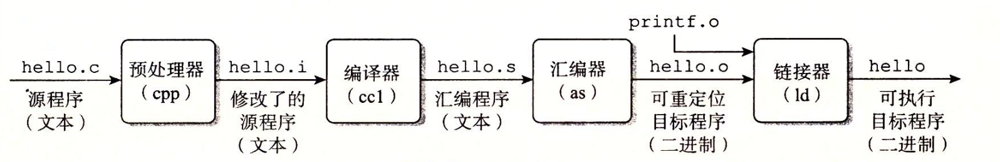

# 1.2 程序被其他程序翻译成不同的格式

hello 程序的生命周期是从一个高级 C 语言程序开始的，因为这种形式能够被人读懂。然而，为了在系统上运行 hello.c 程序，每条 C 语句都必须被其他程序转化为一系列的低级**机器语言**指令。然后这些指令按照一种称为**可执行目标程序**的格式打好包，并以二进制磁盘文件的形式存放起来。目标程序也称为**可执行目标文件。**

在 Unix 系统上，从源文件到目标文件的转化是由**编译器驱动程序**完成的∶

**`linux> gcc -o hello hello.c`**

在这里，GCC 编译器驱动程序读取源程序文件 hello.c，并把它翻译成一个可执行目标文件 hello。这个翻译过程可分为四个阶段完成，如图 1-3 所示。执行这四个阶段的程序（**预处理器**、**编译器**、**汇编器**和**链接器**）一起构成了**编译系统**（compilation system）。



* **预处理阶段。**预处理器（cpp）根据以字符 \# 开头的命令，修改原始的 C 程序。比如 hello.c 中第 1 行的`#include <stdio.h>`命令告诉预处理器读取系统头文件 stdio.h 的内容，并把它直接插入程序文本中。结果就得到了另一个 C 程序，通常是以 .i 作为文件扩展名。 
* **编译阶段。**编译器（ccl）将文本文件 hello.i 翻译成文本文件 hello.s，它包含一个**汇编语言程序**。该程序包含函数 main 的定义，如下所示∶
* ```bash
  main:
      subq $8, %rsp
      movl $.LC0, %edi
      call puts
      movl $0, %eax
      addq $8, %rsp
      ret
  ```

  定义中 2～7 行的每条语句都以一种文本格式描述了一条低级机器语言指令。汇编语言是非常有用的，因为它为不同高级语言的不同编译器提供了通用的输出语言。例如，C编译器和 Fortran 编译器产生的输出文件用的都是一样的汇编语言。

* **汇编阶段。**接下来，汇编器（as）将 hello.s 翻译成机器语言指令，把这些指令打包成一种叫做**可重定位目标程序**（relocatable object program）的格式，并将结果保存在目标文件 hello.o 中。hello.o 文件是一个二进制文件，它包含的 17 个字节是函数 main 的指令编码。如果我们在文本编辑器中打开 hello.o文件，将看到一堆乱码。
* **链接阶段。**请注意，hello 程序调用了 printf 函数，它是每个 C 编译器都提供的标准 C 库中的一个函数。printf 函数存在于一个名为 printf.o 的单独的预编译好了的目标文件中，而这个文件必须以某种方式合并到我们的 hello.o 程序中。链接器（ld）就负责处理这种合并。结果就得到 hello 文件，它是一个**可执行目标文件**（或者简称为**可执行文件**），可以被加载到内存中，由系统执行。


### 旁注 - GNU项目

GCC 是 GNU（GNU 是GNU's Not Unix 的缩写）项目开发出来的众多有用工具之一。GNU 项目是 1984 年由 Richard Stallman 发起的一个免税的慈善项目。该项目的目标非常宏大，就是开发出一个完整的类 Unix 的系统，其源代码能够不受限制地被修改和传播。GNU 项目已经开发出了一个包含 Unix 操作系统的所有主要部件的环境，但内核除外，内核是由 Linux 项目独立发展而来的。GNU 环境包括 EMACS 编辑器、GCC 编译器、GDB 调试器、汇编器、链接器、处理二进制文件的工具以及其他一些部件。GCC 编译器已经发展到支持许多不同的语言，能够为许多不同的机器生成代码。支持的语言包括 C、C++、Fortran、Java、Pascal、面向对象 C 语言（Objective-C）和 Ada。

GNU 项目取得了非凡的成绩，但是却常常被忽略。现代开放源码运动（通常和 Linux 联系在一起）的思想起源是 GNU 项目中自由软件（free software）的概念。（此处的free 为自由言论（free speech）中的“自由”之意，而非免费啤酒（free beer）中的“免费”之意。）而且，Linux 如此受欢迎在很大程度上还要归功于 GNU 工具，它们给 Linux 内核提供了环境。


