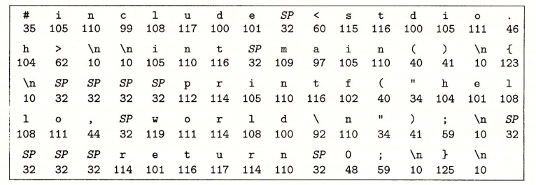

# 1.1 信息就是位 + 上下文

hello 程序的生命周期是从一个**源程序**（或者说源文件）开始的，即程序员通过编辑器创建并保存的文本文件，文件名是 hello.c。源程序实际上就是一个由值 0 和 1 组成的位（又称为比特）序列，8 个位被组织成一组，称为字节。每个字节表示程序中的某些文本字符。

大部分的现代计算机系统都使用 ASCII 标准来表示文本字符，这种方式实际上就是用一个唯一的单字节大小的✦整数值✦来表示每个字符。比如，图 1-2 中给出了 hello.c 程序的 ASCII 码表示。


✦整数值✦：有其他编码方式用于表示非英语类语言文本。具体讨论参见 2.1.4 节的旁注。


hello.c 程序是以字节序列的方式储存在文件中的。每个字节都有一个整数值，对应于某些字符。例如，第一个字节的整数值是 35，它对应的就是字符 “\#”。第二个字节的整数值为 105，它对应的字符是 ‘i’，依此类推。注意，每个文本行都是以一个看不见的换行符 ‘\n’ 来结束的，它所对应的整数值为 10。像 hello.c 这样只由 ASCII 字符构成的文件称为**文本文件**，所有其他文件都称为**二进制文件**。

hello.c 的表示方法说明了一个基本思想∶系统中所有的信息——包括磁盘文件、内存中的程序、内存中存放的用户数据以及网络上传送的数据，都是由一串比特表示的。区分不同数据对象的唯一方法是我们读到这些数据对象时的上下文。比如，在不同的上下文中，一个同样的字节序列可能表示一个整数、浮点数、字符串或者机器指令。 作为程序员，我们需要了解数字的机器表示方式，因为它们与实际的整数和实数是不同的。它们是对真值的有限近似值，有时候会有意想不到的行为表现。这方面的基本原理将在第 2 章中详细描述。


## 旁注 编程语言的起源

C 语言是贝尔实验室的 Dennis Ritchie 于 1969 年 ~ 1973 年间创建的。美国国家标准学会（American National Standards Institute，ANSI）在 1989 年颁布了 ANSI C 的标准，后来 C 语言的标准化成了国际标准化组织（International StandardsOrganization，ISO）的责任。这些标准定义了C语言和一系列函数库，即所谓的 **C 标准库**。Kernighan 和 Ritchie 在他们的经典著作中描述了 ANSI C，这本著作被人们满怀感情地称为 “K&R”【61】。用 Ritchic 的话来说【92】，C 语言是“古怪的、有缺陷的，但同时也是一个巨大的成功”。为什么会成功呢?

* **C 语言与 Unix 操作系统关系密切。**C 从一开始就是作为一种用于 Unix 系统的程序语言开发出来的。大部分 Unix 内核（操作系统的核心部分），以及所有支撑工具和函数库都是用 C 语言编写的。20 世纪 70 年代后期到 80 年代初期，Unix 风行于高等院校，许多人开始接触 C 语言并喜欢上它。因为 Unix 几乎全部是用 C 编写的，它可以很方便地移植到新的机器上，这种特点为 C 和 Unix 赢得了更为广泛的支持。
* **C 语言小而简单。**C语言的设计是由一个人而非一个协会掌控的，因此这是一个简洁明了、没有什么冗赘的设计。K&R 这本书用大量的例子和练习描述了完整的 C 语言及其标准库，而全书不过  261 页。C 语言的简单使它相对而言易于学习，也易于移植到不同的计算机上。 
* **C语言是为实践目的设计的。**C 语言是设计用来实现 Unix 操作系统的。后来，其他人发现能够用这门语言无障碍地编写他们想要的程序。

C 语言是系统级编程的首选，同时它也非常适用于应用级程序的编写。然而，它也并非适用于所有的程序员和所有的情况。C 语言的指针是造成程序员困惑和程序错误的一个常见原因。同时，C 语言还缺乏对非常有用的抽象的显式支持，例如类、对象和异常。像 C++ 和 Java 这样针对应用级程序的新程序语言解决了这些问题。


