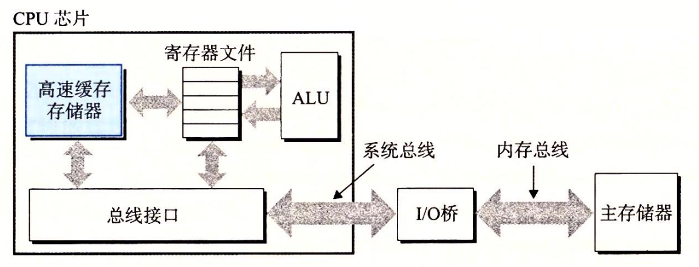

# 1.5 高速缓存至关重要

这个简单的示例揭示了一个重要的问题，即系统花费了大量的时间把信息从一个地方挪到另一个地方。hello ****程序的机器指令最初是存放在磁盘上，当程序加载时，它们被复制到主存；当处理器运行程序时，指令又从主存复制到处理器。相似地，数据串 “hello, world\n” 开始时在磁盘上，然后被复制到主存，最后从主存上复制到显示设备。从程序员的角度来看，这些复制就是开销，减慢了程序“真正”的工作。因此，系统设计者的一个主要目标就是使这些复制操作尽可能快地完成。

根据机械原理，较大的存储设备要比较小的存储设备运行得慢，而快速设备的造价远高于同类的低速设备。比如说，一个典型系统上的磁盘驱动器可能比主存大 1000 倍，但是对处理器而言，从磁盘驱动器上读取一个字的时间开销要比从主存中读取的开销大 1000 万倍。

类似地，一个典型的寄存器文件只存储几百字节的信息，而主存里可存放几十亿字节。然而，处理器从寄存器文件中读数据比从主存中读取几乎要快 100 倍。更麻烦的是，随着这些年半导体技术的进步，这种处理器与主存之间的差距还在持续增大。加快处理器的运行速度比加快主存的运行速度要容易和便宜得多。 针对这种处理器与主存之间的差异，系统设计者采用了更小更快的存储设备，称为**高速缓存存储器**（cache memory，简称为 cache 或高速缓存），作为暂时的集结区域，存放处理器近期可能会需要的信息。图 1-8 展示了一个典型系统中的高速缓存存储器。位于处理器芯片上的 L1 高速缓存的容量可以达到数万字节，访问速度几乎和访问寄存器文件一样快。一个容量为数十万到数百万字节的更大的 L2 高速缓存通过一条特殊的总线连接到处理器。进程访问 L2 高速缓存的时间要比访问 L1 高速缓存的时间长 5 倍，但是这仍然比访问主存的时间快 5~10 倍。L1 和 L2 高速缓存是用一种叫做**静态随机访问存储器**（SRAM）的硬件技术实现的。比较新的、处理能力更强大的系统甚至有三级高速缓存∶L1、L2 和 L3。系统可以获得一个很大的存储器，同时访问速度也很快，原因是利用了高速缓存的局部性原理，即程序具有访问局部区域里的数据和代码的趋势。通过让高速缓存里存放可能经常访问的数据，大部分的内存操作都能在快速的高速缓存中完成。

本书得出的重要结论之一就是，意识到高速缓存存储器存在的应用程序员能够利用高速缓存将程序的性能提高一个数量级。你将在第 6 章里学习这些重要的设备以及如何利用它们。

