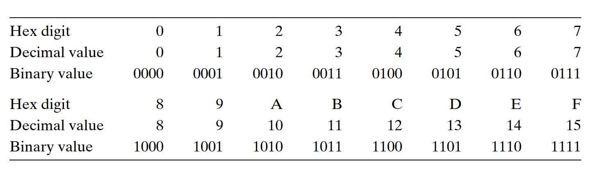
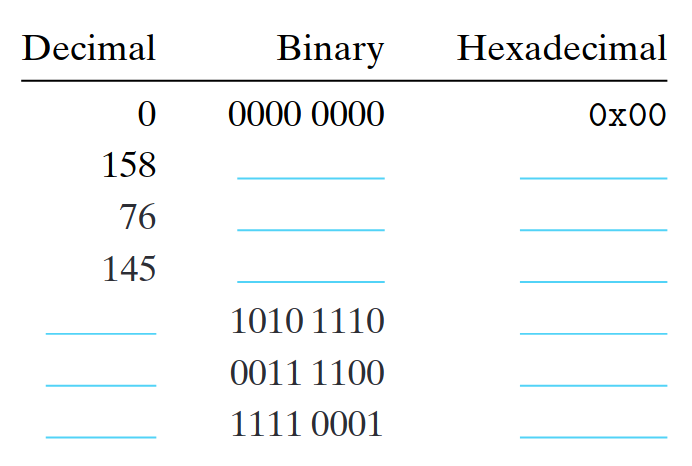
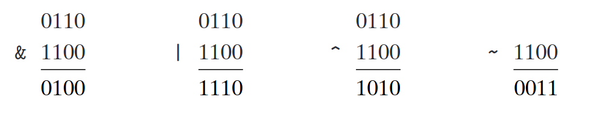
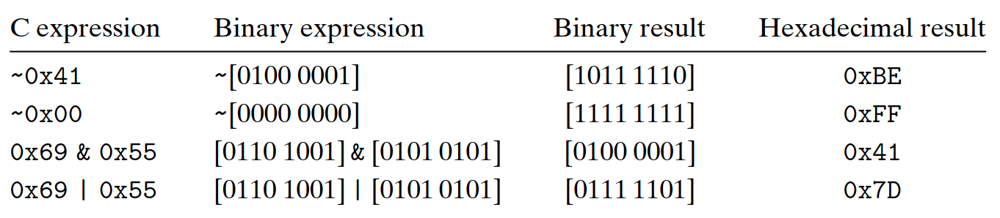
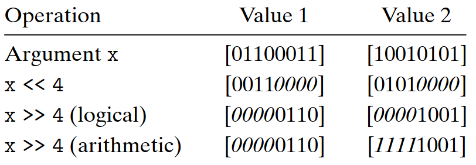

# 2.1 信息存储

大多数计算机使用 8 位的块，或者**字节**（byte），作为最小的可寻址的内存单位，而不是访问内存中单独的位。机器级程序将内存视为一个非常大的字节数组，称为**虚拟内存**（virtual memory）。内存的每个字节都由一个唯一的数字来标识，称为它的**地址**（address），所有可能地址的集合就称为**虚拟地址空间**（virtual address space）。顾名思义，这个虚拟地址空间只是一个展现给机器级程序的概念性映像。实际的实现（见第 9 章）是将动态随机访问存储器（DRAM）、闪存、磁盘存储器、特殊硬件和操作系统软件结合起来，为程序提供一个看上去统一的字节数组。 

在接下来的几章中，我们将讲述编译器和运行时系统是如何将存储器空间划分为更可管理的单元，来存放不同的程序对象（program object），即程序数据、指令和控制信息。可以用各种机制来分配和管理程序不同部分的存储。这种管理完全是在虚拟地址空间里完成的。例如，C 语言中一个指针的值（无论它指向一个整数、一个结构或是某个其他程序对象）都是某个存储块的第一个字节的虚拟地址。C 编译器还把每个指针和类型信息联系起来，这样就可以根据指针值的类型，生成不同的机器级代码来访问存储在指针所指向位置处的值。尽管 C 编译器维护着这个类型信息，但是它生成的实际机器级程序并不包含关于数据类型的信息。每个程序对象可以简单地视为一个字节块，而程序本身就是一个字节序列。


### 给 C 语言初学者 - C 语言中指针的作用

指针是 C 语言的一个重要特性。它提供了引用数据结构（包括数组）的元素的机制。与变量类似，指针也有两个方面：值和类型。它的值表示某个对象的位置，而它的类型表示那个位置上所存储对象的类型（比如整数或者浮点数）。

真正理解指针需要查看它们在机器级上的表示以及实现。这将是第 3 章的重点之 一，3.10.1 节将对其进行深入介绍。


## 2.1.1 十六进制表示法
一个字节由8位组成。使用二进制表示法时，其值的范围从00000000<sub>2</sub>到11111111<sub>2</sub>。以十进制整数形式查看时，其值的范围是0<sub>10</sub>到255<sub>10</sub>。这两种表示法都不便于描述位模式。二进制表示法太冗长，而对于十进制表示法，转换为进位模式和从位模式很繁琐。取而代之的是，我们将位模式写为以16为底的十六进制数字。十六进制（或简称为“十六进制”）使用数字“ 0”至“ 9”以及字符“ A”至“ F”代表16个可能的值。图2.2显示了与16个十六进制数字关联的十进制和二进制值。以十六进制表示，单个字节的值的范围为从00<sub>16</sub>到FF<sub>16</sub>。在C中，以Ox或OX开头的数字常量被解释为十六进制。字符“A”至“F”可以大写或小写。例如，我们可以写数字FA1D37B16为OxFA1D37B或者Oxfa1d37b，甚至混合大小写（例如，OxFa1D37b）。在本书中，我们将使用C符号来表示十六进制值。使用机器级程序的常见任务是手动在位模式的十进制，二进制和十六进制表示之间进行转换。一次可以执行一个十六进制数字。可以通过参考图2.2中所示的图表来转换数字。进行转换的一个简单技巧是记住十六进制数字A，C和F的十进制等效项。

可以通过计算相对于前三个值的十六进制值B，D和E将其转换为十进制值。例如，假设给定的数字为0x173A4C。 您可以通过扩展每个十六进制数字将其转换为二进制格式，如下所示：

| Hexadecimal | 1    | 7    | 3    | A    | 4    | C    |
| :--- | :---: | :---: | :---: | :---: | :---: |:---: |
| Binary      | 0001 | 0111 | 0011 | 1010 | 0100 | 1100 |

这给出了二进制表示000101110011101001001100。

相反，给定二进制数1111001010110110110010011，您首先将其分成4位，将其转换为十六进制。 但是请注意，如果总位数不是4的倍数，则应使最左边的组成为少于4位的那个，有效地用前导零填充数字。 然后，将每组位转换为相应的十六进制数：

| Binary | 11  | 1100 | 1010  | 1101   | 1101  | 0011 |
| :--- | :---: | :---: | :---: | :---: | :---: |:---: |
| Hexadecimal   | 3| C | A | D | B | 3 |

### 练习题2.1
执行以下数字转换：
- A.0x25B9D2到二进制
- B.二进制1010111001001001到十六进制
- C.0xA8B3D到二进制
- D.二进制1100100010110110010110到十六进制 
  
当某个值的幂为2时，即对于某些非负整数，x = 2n，我们可以很容易地通过记住x的二进制表示形式简单地由1后面跟n个零来写十六进制形式。 十六进制数字0表示4个二进制0。 因此，当数字n形式为i + 4j且0≤i≤3，我们可以用前导十六进制数字1（i = 0），2（i = 1），4（i = 2）或8（i = 3）来写x ，后跟十六进制0。 例如，当x = 2,048 = 2<sup>11</sup>，可以得到 `n = 11 = 3 + 4·2`，给出十六进制表示形式0x800
### 练习题2.2
填写下表中的空白条目，以十进制和十六进制表示不同的2的幂：

在十进制和十六进制表示之间进行转换需要使用乘法或除法来处理一般情况。 要将十进制数x转换为十六进制，我们可以将x重复除以16，得到一个商q和一个余数，例如`x=q·16+r`。 然后，我们使用十六进制数字表示-包括最低有效数字，并通过在q上重复该过程来生成其余数字。 例如，考虑十进制314156的转换：

<center>314,156=19,634·16+12    (C)</center>
<center>19,634=1,227·16+2   (2)</center>
<center>1,227=76·16+11  (B)</center>
<center>76=4·16+12  (C)</center>
<center>4=0·16+4    (4)</center>
从中我们可以读出十六进制表示形式为0x4CB2C。相反，要将十六进制数转换为十进制，可以将每个十六进制数字乘以适当的16的幂。例如，给定数字0x7AF，我们将其十进制等效项计算为    7·16<sup>2</sup>+10·16+15=7·256+10·16+15=1,792+160+15=1,967

### 练习题2.3
一个字节可以由2个十六进制数字表示。 填写下表中的缺失条目，给出不同字节模式的十进制，二进制和十六进制值：

除了在十进制和十六进制之间进行转换之外，要在十进制和十六进制之间转换较大的值，最好让计算机或计算器来工作。 有许多工具可以做到这一点。 一种简单的方法是使用任何标准搜索引擎，例如将十六进制的0xabcd转换为十进制或123之类的查询
## 2.1.2 字数据大小
每台计算机都有一个字长，表示指针数据的标称大小。 由于虚拟地址是用这样的字编码的，因此由字长确定的最重要的系统参数是虚拟地址空间的最大大小。 也就是说，对于一字位大小为a<sup>w</sup>的机器，虚拟地址的范围可以从0到2<sup>w</sup>-1，从而使程序最多可以访问2<sup>w</sup>字节。近年来，从32位的机器到字长为64位的机器开始发生了广泛的变化。 这首先发生在为大型科学和数据库应用程序设计的高端计算机上，其次是台式机和笔记本计算机，最近发生在智能手机中的处理器上。 32位字长将虚拟地址空间限制为4 GB（写4 GB），即刚好超过4×109字节。 扩展到64位字长会导致16艾字节（约1.84×1019字节）的虚拟地址空间。

>图2.3基本C数据类型的典型大小（以字节为单位）分配的字节数随程序的编译方式而变化%20该图显示了32位和64位程序的典型值

大多数64位计算机还可以运行为在32位机器上使用而编译的程序，这是向后兼容的形式。 因此，例如，当程序prog.cis使用伪指令编译时

`linux>gcc -m32 prog.c`

那么该程序将在32位或64位计算机上正确运行。 另一方面，用指令编译的程序

`linux>gcc -m64 prog.c`

只能在64位计算机上运行。因此，我们将程序称为“ 32位程序”或“ 64位程序”，因为区别在于程序的编译方式，而不是运行程序的机器类型。计算机和编译器支持多种数据格式使用不同的方式对数据进行编码，例如整数和浮点数以及不同的长度。例如，许多机器都有用于处理单个字节以及以2、4和8字节表示的整数的指令。它们还支持以4字节和8字节数量表示的浮点数。C语言支持整数和浮点数据的多种数据格式。图2.3显示了通常为不同的C数据类型分配的字节数。 （我们讨论了C标准所保证的内容与2.2节中典型内容之间的关系。）某些数据类型的确切字节数取决于程序的编译方式。我们显示了典型的32位和64位程序的大小。整数数据可以是带符号的，可以表示负值，零和正值，也可以是无符号的，仅允许非负值。数据类型字符表示一个字节。尽管该名称具有以下特征：它用于在文本字符串中存储单个字符，但它也可以用于存储整数值。数据类型short，int和long旨在提供一定范围的大小。即使是为64位系统编译的，数据类型通常也只有4个字节。长数据类型通常在32位程序中只有4个字节，而在64位程序中只有8个字节。为了避免依赖“典型”大小和不同的编译器设置的麻烦， ISO C99引入了一类数据类型，其中数据大小是固定的，而与编译器和机器设置无关。其中有数据类型sint32_t和int64_t，分别具有正好4个字节和8个字节。使用固定大小的整数类型是程序员密切控制数据表示的最佳方法。大多数数据类型都对带符号的值进行编码，除非以关键字unsigned开头或对固定大小的数据类型使用特定的无符号声明。例外是数据类型字符。尽管大多数编译器和计算机将其视为签名数据，但C标准不能保证这一点。相反，如方括号所示，程序员应使用带符号声明的图表保证1个字节的带符号值。但是，在许多情况下，程序的行为对于数据类型是带符号的还是不带符号的都不敏感。C语言允许使用多种方式对关键字进行排序以及包括或省略可选关键字。作为示例，以下所有声明均具有相同的含义：

`unsigned long`

`unsigned long int`

`long unsigned`

`long unsigned int`

### C的新手？
声明指针对于任何数据类型T，声明T * p; 指示它是一个指针变量，指向类型为T的对象。 例如，char * p;是指向char类型对象的指针的声明

我们将一贯使用图2.3中的格式。图2.3还显示了一个指针（例如，声明为char *类型的变量）使用了程序的完整字长。 大多数机器还支持两种不同的浮点格式：单精度（在C中声明为float）和双精度（在C中声明为double）。 这些格式分别使用4和8字节。程序员应努力使自己的程序可在不同的机器和编译器之间移植。 可移植性的一方面是使程序对不同数据类型的确切大小不敏感。 关于不同数据类型的数值范围C标准设定了下限，这将在后面介绍，但是没有上限（固定大小类型除外）。 从1980年到2010年左右，32位机器和32位程序是主要组合，编写许多程序时都假定图2.3中列出了32位程序的分配。 随着向64位计算机的过渡，随着将这些程序迁移到新计算机中的错误，出现了许多隐藏字长相关性。 例如，许多程序员在历史上一直认为声明为int类型的对象可用于存储指针。 这对于大多数32位程序都可以正常工作，但是会导致64位程序出现问题。


## 2.1.3 寻址和字节顺序
对于跨越多个字节的程序对象，我们必须建立两个约定：对象的地址将是什么，以及如何对内存中的字节进行排序。实际上，在所有机器中，多字节对象都存储为连续的字节序列，而对象的地址由所用字节的最小地址给出。例如，假设int类型的变量x的地址为0x100；也就是说，地址表达式＆x的值为0x100。然后（假设数据类型为32位表示），x的4个字节将存储在存储位置0x100、0x101、0x102和0x103中。为了对表示对象的字节进行排序，有两种常见约定。考虑具有位表示形式$[x_w-1，xw_-2，...，x_1，x_0]$的w位整数，其中xw-1是最高有效位，x0是最低有效位。假设为8的倍数，则这些位可以分组为字节，最高有效字节为位$[x_w-1，x_w-2，...，x_w-8]$，最低有效字节为位$[x_7，x_6，]。 ..，x_0]$，其他字节从中间开始有位。一些机器选择将对象从最低有效字节到最高顺序存储，而其他机器选择从最高字节到最低顺序存储它们。前一种约定（最低有效字节在前）被称为小端字节序（little endian）。后者的约定（最高有效字节在前）被称为大端法(big endian)。假设int类型的变量x的地址为0x100，十六进制值为0x01234567。地址范围0x100到0x103中的字节顺序取决于机器的类型：

大端法

| \*\*\*\* | 0x100 | 0x101 | 0x102 | 0x103 |  |
| :--- | :---: | :---: | :---: | :---: | :---: |
| ⋯ | 01 | 23 | 45 | 67 | ⋯ |

小端法

| \*\*\*\* | 0x100 | 0x101 | 0x102 | 0x103 |  |
| :--- | :---: | :---: | :---: | :---: | :---: |
| ⋯ | 67 | 45 | 23 | 01 | ⋯ |
请注意，在字0x01234567中，高位字节的值为十六进制值0x01，而低位字节的值为0x67。大多数与Intel兼容的计算机仅以低字节序模式运行。
另一方面，IBM和Oracle的大多数计算机（由于2010年对Sun Microsystems的收购而产生）都在大端模式下运行。
请注意，我们说的是“最多”。约定没有沿公司边界精确划分。
例如，IBM和Oracle都制造使用Intel兼容处理器的机器，因此它们的字节序很少。
最近的许多微处理器芯片都是双端的，这意味着它们可以配置为低端或高端机器。
但是，实际上，一旦选择了特定的操作系统，字节顺序就变得固定了。
例如，许多手机中使用的ARM微处理器具有可以在小端或大端模式下运行的硬件，
但是这些芯片的两个最常见的操作系统是Android（来自Google）和IOS（来自Apple）。仅在小字节序模式下运行。人们对于哪种字节顺序是正确的字节序感到惊讶。
事实上，术语“小尾数”和“大尾数”来自乔纳森·斯威夫特（Jonathan Swift）的《格列佛游记》，其中两个交战派别不同意。
怎样打开软煮蛋—从小头到大头。就像鸡蛋一样，没有技术上的理由选择一个字节排序约定而不选择另一个字节排序约定，因此，论点退化为关于社会政治问题的争论。只要选择了一种约定并始终如一地遵守，选择就是任意的。对于大多数应用程序程序员来说，它们的计算机使用的字节顺序是完全不可见的；为任何一类机器编译的程序都会得出相同的结果。但是，有时字节顺序成为一个问题。第一种是二进制数据在不同机器之间通过网络进行通信时。常见的问题是将小端序机器生成的数据发送到大端序机器，反之亦然，导致字中的字节与接收程序相反。为避免此类问题，为网络应用程序编写的代码必须遵循已建立的字节顺序约定，以确保发送机将其内部表示转换为网络标准，而接收机将网络标准转换为内部标准。我们将在第11章中看到这些转换的示例。字节排序变得重要的第二种情况是查看表示整数数据的字节序列。这在检查机器级程序时经常发生。例如，以下行出现在一个文件中，该文件给出了Intel x86-64处理器的计算机级代码的文本表示形式：
>4004d3:  01 05 43 0b 20 00     add    %eax,0x200b43(%rip)

该行由反汇编程序生成，反汇编程序是一种确定可执行程序文件表示的指令序列的工具。我们将在第3章中了解有关反汇编程序以及如何解释此类行的更多信息。现在，我们仅注意到该行指出十六进制字节序列01 05 43 0b 20 00是添加数据字的指令的字节级表示形式。到存储在通过将0x200b43加到程序计数器的当前值所计算出的地址处的值，即要执行的下一条指令的地址。如果我们取序列43 0b 20 00的最后4个字节并以相反的顺序写入它们，则我们有00 20 0b 43.删除前导0，我们得到的值为0x200b43，该数值写在右边。当读取为这种低端字节顺序的机器生成的机器级程序表示形式时，字节的出现顺序相反是常见的情况。写入字节序列的自然方法是在左侧具有最低编号的字节，在右侧具有最高的字节，但这与通常在左侧写入最高位而在右侧最少的数字的正常方式相反。字节顺序可见的第三种情况是编写规避普通类型系统的程序时。在C语言中，可以使用castor aunion完成此操作，以允许根据创建对象时所用的不同数据类型来引用该对象。对于大多数应用程序编程，强烈建议不要使用这种编码技巧，但是它们可能非常有用，甚至对于系统级编程也是必需的。图2.4显示了使用强制转换来访问和打印不同程序对象的字节表示形式的C代码。我们使用def类型将数据typebyte_pointer定义为指向unsigned char类型对象的指针。这样的字节指针引用字节序列，其中每个字节都被视为非负整数。第一个例程show_bytesis给定了一个字节序列的地址，该字节序列由一个字节指针和一个字节计数指示。字节计数指定为具有datatypeize_t，这是表示数据结构大小的首选数据类型。它以十六进制打印单个字节。 C格式指令％.2x指示应使用至少2位的十六进制打印整数。

``` c++
#include <stdio.h>

type def unsigned char *byte_pointer;

void show_bytes(byte_pointer start, size_t len){
    int i;
    for (i = 0; i < len; i++)
        printf(" %.2x", start[i]);
    printf("\n");
}

void show_int(int x) {
    show_bytes((byte_pointer) &x, sizeof(int));
}

void show_float(float x) {
    show_bytes((byte_pointer) &x, sizeof(float));
}

    void show_pointer(void *x) {
    show_bytes((byte_pointer) &x, sizeof(void *));
}

```
图2.4用来打印程序对象字节表示形式的代码此代码使用强制转换来规避类型系统。 对于其他数据类型，可以轻松定义类似的功能。
    


过程show_int，show_float和show_pointer演示了如何使用过程show_bytes分别打印int，float和void *类型的C程序对象的字节表示。请注意，他们只是将show_bytesa指针＆x传递给其参数x，将指针转换为unsigned char *类型。此强制转换向编译器指示程序应将指针视为字节序列，而不是原始数据类型的对象。然后，该指针将指向对象占用的最低字节地址。这些过程使用C sizeof运算符确定对象使用的字节数。通常，表达式sizeof（T）返回存储类型T的对象所需的字节数。使用sizeof（而不是固定值）是编写可在不同机器类型上移植的代码的第一步。我们在几台不同的机器上运行了图2.5所示的代码，结果如图2.6所示。使用了以下机器：

Linux 32            运行Linux的Intel IA32处理器。

Windows             运行Windows的Intel IA32处理器。

SunSun Microsystems 运行Solaris的SPARC处理器。 （这些机器现在由Oracle生产。）

Linux 64            运行Linux的Intel x86-64处理器。

``` c++
void test_show_bytes(int val) {
    int ival = val;
    float fval = (float) ival;
    int *pval = &ival;
    show_int(ival);
    show_float(fval);
    show_pointer(pval);
}
```
图2.5字节表示示例。此代码打印示例数据对象的字节表示。


>图2.6不同数据值的字节表示形式除了字节顺序外，int和float的结果相同。 指针值取决于机器。

我们的参数12,345具有十六进制表示形式0x00003039。 对于int数据，除字节顺序外，我们在所有计算机上均得到相同的结果。 特别是，我们可以看到，在Linux 32，Windows和Linux 64上，最低有效字节值0x39的第一个被打印出来，表示低端字节序的机器，而在Sun则是最后一个字节，则表示一个大端字节序的机器。 同样，除字节顺序外，float数据的字节相同。 另一方面，指针值完全不同。 不同的机器/操作系统配置使用不同的约定进行存储分配。 要注意的功能之一是Linux 32，Windows和Sun计算机使用4字节地址，而Linux 64计算机使用8字节地址。

### C的新手？ 用typedef命名数据类型

C语言中的typedef声明提供了一种为数据类型命名的方法。 这可能有助于提高代码的可读性，因为深度嵌套的类型声明可能难以解读。typedef的语法与声明变量的语法完全相同，只是它使用类型名而不是变量名。 因此，图2.4中的byte_pointer声明与无符号char *类型变量的声明具有相同的形式。
> typedef int *int_pointer;
\
> int_pointer ip;

将类型int_pointer定义为指向int的指针，并声明此类型的变量ip。 或者，我们可以直接将此变量声明为

>int *ip;

### C的新手？ 使用printf进行格式化打印
printf函数（及其表亲fprintf和sprintf）提供了一种在格式化细节方面具有相当大控制能力的打印信息的方式。 第一个参数是格式字符串，而其余所有参数都是要打印的值。 在格式字符串中，每个以“％”开头的字符序列均表示如何格式化下一个参数。 典型的示例包括％d打印一个十进制整数，％f打印一个浮点数和％c打印一个具有自变量给定字符代码的字符。S指定固定大小的数据类型的格式，例如int_32t 如第103页上的a所述，它涉及的内容更多。

请注意，尽管浮点数和整数数据都对数值12345进行了编码，但是对于整数，它们具有非常不同的字节模式：0x00003039，对于浮点它们具有0x4640E400。 通常，这两种格式使用不同的编码方案。 如果将这些十六进制模式扩展为二进制形式并适当地进行移位，则会发现由13个匹配位组成的序列，由星号序列表示，如下所示：
    0   0   0   0   3   0   3   9
   00000000000000000011000000111001
                      *************
               4   6   4   0   E   4   0   0   
             01000110010000001110010000000000
这不是偶然的。 当我们研究浮点格式时，我们将返回到此示例。
### C的新手？ 指针和数组
在函数show_bytes（图2.4）中，我们看到了指针和数组之间的紧密连接，这将在3.8节中详细讨论。 我们看到该函数的参数开始类型为byte_pointer（已定义为指向无符号char的指针），但是我们在第8行看到了数组引用start [i]。在C语言中，我们可以使用数组取消引用指针 表示法，我们可以使用指针表示法引用数组元素。 在此示例中，参考start [i]表示我们要读取的字节是start指向的位置之外i位置的字节。
### C的新手？ 指针创建和取消引用
在图2.4的第13、17和21行中，我们看到了两个操作的使用，这两个操作赋予了C（以及C ++）独特的性格。 运算符“＆”的C“地址”创建一个指针。 在所有三行中，表达式＆x创建一个指向保存变量x所指示对象的位置的指针。 该指针的类型取决于x的类型，因此这三个指针的类型分别为int *，float *和void **。 （数据类型void *是一种特殊的指针，没有关联的类型信息。）强制转换运算符从一种数据类型转换为另一种数据类型。 因此，强制类型转换（byte_pointer）＆x表示指针＆x以前具有的类型，程序现在将引用一个指向unsigned char类型数据的指针。 此处显示的强制类型转换不会更改实际指针。 它们只是指示编译器根据新数据类型引用所指向的数据。

### 旁录 生成ASCII表
您可以通过执行命令`man ascii`显示显示ASCII字符代码的表。

## 2.1.4 表示字符串
C中的字符串由以null（具有值0）字符终止的字符数组编码。 每个字符都由某种标准编码表示，最常见的是ASCII字符代码。 因此，如果运行带有参数“ 12345”和6（包括终止字符）的例程show_bytes，我们将得到结果31 32 33 34 35 00。请注意，十进制数字x的ASCII码恰好是0x3x，并且 终止字节的十六进制表示形式为0x00。 在使用ASCII作为其字符代码的任何系统上，都可以得到相同的结果，而与字节顺序和字长约定无关。 结果，文本数据比二进制数据更不受平台约束。

## 2.1.5 表示代码
考虑以下C函数：

```c++
int sum(int x, int y) {
    return x+y;
}
```
在示例计算机上编译时，我们生成具有以下字节表示形式的机器代码：
```
Linux 32    55 89 e5 8b 45 0c 03 45 08 c9 c3
Windows     55 89 e5 8b 45 0c 03 45 08 5d c3
Sun         81 c3 e0 08 90 02 00 09 
Linux 64    55 48 89 e5 89 7d fc 89 75 f8 03 45 fc c9 c3
```
### 旁录 文字编码的Unicode标准
ASCII字符集适用于对英语文档进行编码，但是它没有太多特殊字符，例如法语‘̧c’。它完全不适合使用希腊语，俄语和中文等语言对文档进行编码。多年来，已经开发出各种方法来编码不同语言的文本。 Unicode协会已设计出最全面，最广为接受的用于编码文本的标准。当前的Unicode标准（版本7.0）具有超过100,000个字符的库，支持多种语言，包括埃及和巴比伦等古代语言。值得赞扬的是，Unicode技术委员会拒绝了为电视剧《星际迷航》（Star Trek）中的虚构文明Klingon编写标准文字的提议。基本编码被称为Unicode的“通用字符集”，使用32位表示法。字符。这似乎要求每个文本字符串每个字符包含4个字节，但是，在常见字符仅需要1个或2个字节而不太常见的字符需要更多个字符的情况下，也可以使用替代编码。特别是，UTF-8表示将每个字符按字节顺序编码，以便标准ASCII字符使用与ASCII中相同的单字节编码，这意味着所有ASCII字节序列在UTF-8中的含义与它们使用ASCII。Java编程语言在字符串表示中使用Unicode。程序库也可用于C以支持Unicode。

在这里，我们发现指令编码是不同的。 不同的机器类型使用不同且不兼容的指令和编码。 即使是运行不同操作系统的相同处理器，其编码约定也有所不同，因此不是二进制兼容的。 二进制代码很少能跨机器和操作系统的不同组合进行移植。计算机系统的基本概念是，从机器的角度来看，程序只是一个字节序列。 除了可能维护了一些辅助表以帮助调试外，该机器没有有关原始源程序的信息。 在第3章学习机器级编程时，我们会更清楚地看到这一点。

## 2.1.6 布尔代数简介

由于二进制值是计算机编码，存储和处理信息的核心，因此围绕值0和1的研究已经发展出了丰富的数学知识。这始于George Boole（1815-1864）的工作。 大约在1850年，因此被称为布尔代数。 Boole观察到，通过将逻辑值true和false编码为二进制值1和0，他可以制定一个表示逻辑推理基本原理的代数。最简单的布尔代数定义在两元素集{0,1}上。图2.7在此定义了几个运算 代数 我们选择的代表这些操作的符号要与C位级别的操作所使用的符号相匹配，


由于二进制值是计算机编码，存储和操作信息的核心，因此围绕值0和1的研究已经发展出了丰富的数学知识。
这始于乔治·布尔（George Boole，1815–1864）的工作。
1850年，因此被称为布尔代数。布尔观察到，通过将逻辑值true和false编码为二进制值1和0，
他可以制定一个表示逻辑推理基本原理的代数。最简单的布尔代数定义在两元素集{0,1}上。
图2.7定义此代数中的几个运算。选择用于表示这些操作的符号以匹配C位级操作所使用的符号，这将在后面讨论。
布尔运算符〜对应于逻辑运算符 非 ，由符号¬表示。也就是说，我们说¬P在P不为真时为真，反之亦然。
相应地，当p等于0时〜p等于1 ，反之亦然。
布尔运算符＆对应于逻辑运算符 与 ，并用符号＆表示。我们说当P和Q都为真时，P∧Q成立。
相应地，仅当p = 1和q = 1时p＆q等于1。
布尔运算|对应于逻辑运算符 或，也用符号∨表示。我们说当P为真或Q为真时，P∨Q成立。
相应地，当p = 1或q = 1时，p | q等于1。
布尔运算符^对应于逻辑运算符“异或”，用符号^表示。我们说，当P为真或Q为真时，P⊕Q成立，但两者都不成立。
相应地，当p = 1和q = 0或p = 0和q = 1时，p ^ q等于1。
后来创立信息论领域的克劳德·香农（Claude Shannon，1916-2001年）首先建立了布尔代数之间的联系。
和数字逻辑。在他1937年的硕士论文中，他证明了布尔代数可以用于机电继电器网络的设计和分析。
尽管自那时以来计算机技术已经取得了长足的进步，但是布尔代数在数字系统的设计和分析中仍然发挥着核心作用。
我们可以扩展这四个布尔运算，以便对位向量，零位字符串和固定长度w的位向量进行操作。
我们根据位向量对参数匹配元素的应用来定义位向量的运算。让a和b表示位向量$[a_w-1，a_w-2，...，a_0]$和$[b_w-1，b_w- 2，...，b_0]$。我们将a＆b定义为也是一个长度为w的位向量，其中对于0≤i<w，
i等于$a_i＆b_i$。将|，^和〜操作以类似的方式扩展到位向量。
例如，请考虑w = 4且参数为a = [0110]和b = [1100]的情况。然后，四个操作a＆b，a | b，a ^ b和〜b产生

### 网页和数据旁录：BOOL有关布尔代数和布尔环的更多信息

布尔运算|，＆和〜对长度为w的任何整数w> 0的位向量进行运算，
形成布尔代数。最简单的情况是w = 1且只有两个元素，但更一般的情况是存在2w个长度为w的位向量。
布尔代数与整数运算具有许多相同的属性。例如，就像乘法在加法上分布，写为a·（b + c）=（a·b）+（a·c），
布尔运算 & 在|上，写为 a ＆（b | c）=（a＆b）|（a＆c） 。另外。布尔运算|分布在＆上，因此我们可以写a |（b＆c）=（a | b）＆（a | c），
其中我们不能说a +（b·c）=（a + b）·（a + c）成立当我们考虑对长度为w的位向量进行运算^，＆和〜时，
我们得到了另一种数学形式，称为布尔环。布尔环具有许多与整数算术相同的属性。
例如，整数算术的一个特性是每个值x都有一个反数-x，使得x + -x = 0。布尔环具有类似的属性，
其中^是“加法”运算，但是在这种情况下，每个元素都是其自己的加法逆。
也就是说，对于任何值a，a ^ a = 0，这里我们用0表示全零的位向量。
由于0 ^ 0 = 1 ^ 1 = 0，我们可以看到这适用于单个位，并且它也扩展到位向量。即使重新排列术语并以不同顺序组合它们，该属性仍然成立，因此（a ^ b）^ a = b。正如我们将在问题2.10中探讨的那样，此属性导致一些有趣的结果和巧妙的窍门。

位向量的一种有用应用是表示有限集。
我们可以用位向量$[a_w-1，...，a_1，a_0]$编码任何子集$A⊆{0,1，...，w-1}$，其中ai = 1并且仅当i∈A时。
例如，回想一下我们在左边写$a_w-1$，在右边写a0，位向量a = [01101001]编码集合A = {0,3,5,6}，而位向量b = [01010101]编码集合a = {0,3,5,6}。
设置B = {0,2,4,6}。通过这种编码集的方式，布尔运算|和＆分别对应于集合并集和交集，而〜对应于集合补集。继续前面的示例，
操作a＆b产生位向量[01000001]，而A∩B= {0,6}。在许多实际应用中，我们将看到按位向量对集合进行编码。例如，在第8章中，我们将看到有许多不同的信号可以中断程序的执行。
我们可以通过指定位向量掩码来有选择地启用或禁用不同的信号，其中位位置i中的a1表示信号i被启用，而0表示信号i被禁用。因此，掩码表示启用信号的集合。

## 2.1.7 C 语言中的位级运算
C的一个有用功能是它支持按位布尔运算。 实际上，我们用于布尔运算的符号正是C：所使用的符号。|表示或 ，＆表示与，〜表示非，而^表示异或。 这些可以应用于任何“整体”数据类型，包括图2.3中列出的所有数据类型。 以下是数据类型为char的表达式求值的一些示例：

如我们的示例所示，确定位级表达式效果的最佳方法是将十六进制参数扩展为它们的二进制表示形式，以二进制形式执行操作，然后再转换回十六进制。
比特级操作的一种常见用法是实现屏蔽操作，其中屏蔽是一种位模式，该模式指示一个单词中包含一组选定的位。 例如，掩码0xFF（最低有效8位为1）表示一个字的低位字节。 位级操作x＆0xFF产生一个值，该值由x的最低有效字节组成，但所有其他字节均设置为0。例如，对于x = 0x89ABCDEF，该表达式将产生0x000000EF。表达式〜0将产生一个 所有数据的掩码，无论数据表示的大小如何。 当数据类型int为32位时，可以将相同的掩码写为0xFFFFFFFF，但它不那么可移植。

## 2.1.8 C 语言中的逻辑运算
C还提供了一组逻辑运算符||，&&和!!，它们对应于逻辑运算符and，and和not。 这些很容易与位级操作混淆，但是它们的行为却大不相同。 逻辑运算将任何非零参数视为true，将参数0视为false，它们返回1或0，分别表示true或false的结果。以下是表达式求值的一些示例：
```
Expression      Result  
!0x41           0x00
!0x00           0x01
!!0x41          0x01
0x69 && 0x55    0x01
0x69 || 0x55    0x01
```
请注意，只有在参数限制为0或1的特殊情况下，按位运算才具有与其逻辑计数器部分相匹配的行为。逻辑运算符“ &&”和“ ||”与它们的位之间的第二个重要区别是- 级别对应项“＆”和“ |”是，如果可以通过评估第一个参数来确定表达式的结果，则逻辑运算符不会评估其第二个参数。 因此，例如，表达式a && 5 / a绝不会导致被零除，而表达式p && * p ++绝不会导致对空指针的解引用。


## 2.1.9 C 语言中的移位运算
C还提供了一组移位操作，用于向左和向右移位位模式。
对于具有位表示$[x_w-1，x_w-2，...，x_0]$的操作数x，表达式x << k产生一个具有位表示$[x_wk-1，x_w-k-2，...，x_0,0，...，0]$。
也就是说，x向左移动k位，丢弃k个最高有效位，并用k个零填充右端。偏移量应为0到w-1之间的值。
移位操作从左到右关联，因此x << j << k等效于（x << j）<< k。有一个相应的右移位操作，用C编写为x >> k，但是它有一个略微微妙的行为。
通常，机器支持两种形式的右移：逻辑。逻辑右移用k个零填充左端，结果为$[0，...，0，x_w-1，x_w-2，... x_k]$。算术。
算术右移用最高有效位的k个重复填充左端，得到结果$[x_w-1，...，x_w-1，x_w-1，x_w-2，... x_k]$。
约定可能看起来很奇怪，但是正如我们将看到的那样，它对于处理带符号整数数据很有用，例如，下表显示了对8位参数x的两个不同值应用不同的移位操作的效果：

斜体数字表示填充右端（左移）或左端（右移）的值。 请注意，除了一个条目外，所有条目都涉及零填充。 例外是算术右移[10010101]的情况。 由于其最高有效位为1，因此将其用作填充值。C标准未精确定义应使用带正负号的右移类型，可以使用算术或逻辑移位。 不幸的是，这意味着任何采用一种形式或另一种形式的代码都可能会遇到可移植性问题。 但是实际上，几乎所有编译器/机器组合都对有符号数据使用算术右移，并且许多程序员都认为是这种情况。 另一方面，对于无符号数据，右移必须是逻辑上的。与C相比，Java对应如何执行右移具有精确的定义。 表达式x >> k将x算术上移位k个位置，而x >>> k则将其逻辑上移位。
对于k的较大值，除了按k移位
对于由w位组成的数据类型，偏移k≥w某个值的影响应该是什么？例如，假设数据类型int的w = 32，则计算以下表达式的结果将是什么：
```
int lval = 0xFEDCBA98 << 32;
int aval = 0xFEDCBA98 >> 36;
unsigned uval = 0xFEDCBA98 u >> 40;
```
C标准小心地避免指出在这种情况下应采取的措施。在许多机器上，移位指令在移位w位值时仅考虑移位量的低log2 w位，因此移位量被计算为k mod w。
例如，在w = 32的情况下，将分别计算上述三个移位，就好像它们的数量分别为0、4和8，从而得出结果：
```
lval 0xFEDCBA98
aval 0xFFEDCBA9
uval 0x00FEDCBA
```

但是，对于C程序，不能保证此行为。因此，移位量应保持小于字长。另一方面，Java明确要求，移位量应以我们展示的模块化方式进行计算。
### 旁录 与移位运算符优先级问题
写表达式 1 << 2 + 3 << 4 可能会很吸引人，以为表示为（1 << 2）+（3 << 4）。 但是，在C中，前一个表达式等于1 <<（2 + 3）<< 4，因为加（和减）的优先级高于移位。 然后从左到右的关联性规则将其括为（1 <<（2 + 3））<< 4，给出值512，而不是预期的52.在C表达式中获取优先级错误是常见原因 程序错误，通常很难通过检查发现这些错误。 如有疑问，请加括号！