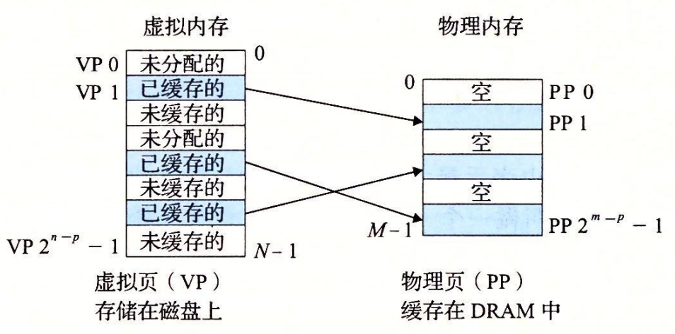

# 9.3 虚拟内存作为缓存的工具

概念上而言，虚拟内存被组织为一个由存放在磁盘上的 N 个连续的字节大小的单元组成的数组。每字节都有一个唯一的虚拟地址，作为到数组的索引。磁盘上数组的内容被缓存在主存中。和存储器层次结构中其他缓存一样，磁盘（较低层）上的数据被分割成块，这些块作为磁盘和主存（较高层）之间的传输单元。VM 系统通过将虚拟内存分割为称为**虚拟页**（Virtual Page，VP）的大小固定的块来处理这个问题。每个虚拟页的大小为 $$\small P = 2^p$$ 字节。类似地，物理内存被分割为**物理页**（Physical Page，PP），大小也为 P 字节（物理页也被称为**页帧**（page frame））。

在任意时刻，虚拟页面的集合都分为三个不相交的子集：

* **未分配的：**VM 系统还未分配（或者创建）的页。未分配的块没有任何数据和它们相关联，因此也就不占用任何磁盘空间。
* **缓存的：**当前已缓存在物理内存中的已分配页。
* **未缓存的：**未缓存在物理内存中的已分配页。

图 9-3 的示例展示了一个有 8 个虚拟页的小虚拟内存。虚拟页 0 和 3 还没有被分配，因此在磁盘上还不存在。虚拟页 1、4 和 6 被缓存在物理内存中。页 2、5 和 7 已经被分配了，但是当前并未缓存在主存中。

## 9.3.1 DRAM 缓存的组织结构

为了有助于清晰理解存储层次结构中不同的缓存概念，我们将使用术语 **SRAM 缓存**来表示位于 CPU 和主存之间的 Ll、L2 和 L3 高速缓存，并且用术语 DRAM 缓存来表示虚拟内存系统的缓存，它在主存中缓存虚拟页。

在存储层次结构中，DRAM 缓存的位置对它的组织结构有很大的影响。回想一下，DRAM 比 SRAM 要慢大约 10 倍，而磁盘要比 DRAM 慢大约 100000 多倍。因此，DRAM 缓存中的不命中比起 SRAM 缓存中的不命中要昂贵得多，这是因为 DRAM 缓存不命中要由磁盘来服务，而 SRAM 缓存不命中通常是由基于 DRAM 的主存来服务的。而且，从磁盘的一个扇区读取第一个字节的时间开销比起读这个扇区中连续的字节要慢大约 100000 倍。归根到底，DRAM 缓存的组织结构完全是由巨大的不命中开销驱动的。

因为大的不命中处罚和访问第一个字节的开销，虚拟页往往很大，通常是 4KB ~ 2MB。由于大的不命中处罚，DRAM 缓存是全相联的，即任何虚拟页都可以放置在任何的物理页中。不命中时的替换策略也很重要，因为替换错了虚拟页的处罚也非常之高。因此，与硬件对 SRAM 缓存相比，操作系统对 DRAM 缓存使用了更复杂精密的替换算法。（这些替换算法超出了我们的讨论范围）。最后，因为对磁盘的访问时间很长，DRAM 缓存总是使用写回，而不是直写。

## 9.3.2 页表

同任何缓存一样，虚拟内存系统必须有某种方法来判定一个虚拟页是否缓存在 DRAM 中的某个地方。如果是，系统还必须确定这个虚拟页存放在哪个物理页中。如果不命中，系统必须判断这个虚拟页存放在磁盘的哪个位置，在物理内存中选择一个牺牲页，并将虚拟页从磁盘复制到 DRAM 中，替换这个牺牲页。

这些功能是由软硬件联合提供的，包括操作系统软件、MMU（内存管理单元）中的地址翻译硬件和一个存放在物理内存中叫做**页表**（page table）的数据结构，页表将虚拟页映射到物理页。每次地址翻译硬件将一个虚拟地址转换为物理地址时，都会读取页表。操作系统负责维护页表的内容，以及在磁盘与 DRAM 之间来回传送页。

图 9-4 展示了一个页表的基本组织结构。页表就是一个页表条目（Page Table Entry，PTE）的数组。虚拟地址空间中的每个页在页表中一个固定偏移量处都有一个 PTE。为了我们的目的，我们将假设每个 PTE 是由一个有效位（valid bit）和一个 n 位地址字段组成的。有效位表明了该虚拟页当前是否被缓存在 DRAM 中。如果设置了有效位，那么地址字段就表示 DRAM 中相应的物理页的起始位置，这个物理页中缓存了该虚拟页。如果没有设置有效位，那么一个空地址表示这个虚拟页还未被分配。否则，这个地址就指向该虚拟页在磁盘上的起始位置。

图 9-4 中的示例展示了一个有 8 个虚拟页和 4 个物理页的系统的页表。四个虚拟页（VP 1、VP 2、VP 4 和 VP 7）当前被缓存在 DRAM 中。两个页（VP 0 和 VP 5 ）还未被分配，而剩下的页（VP 3 和 VP 6）已经被分配了，但是当前还未被缓存。图 9-4 中有一个要点要注意，因为 DRAM 缓存是全相联的，所以任意物理页都可以包含任意虚拟页。

### 练习题 9.2



确定下列虚拟地址大小（n）和页大小（P）的组合所需要的 PTE 数量：

| n | $$\small P=2^p$$  | PTE数量 |
| :---: | :---: | :---: |
| 16 | 4K |  |
| 16 | 8K |  |
| 32 | 4K |  |
| 32 | 8K |  |





因为每个虚拟页面是$$\small P=2^p$$字节，所以在系统中总共有$$\small 2^n/2^p = 2^{n-p}$$个可能的页面，其中每个都需要一个页表条目（PTE）。

| n | $$\small P=2^p$$  | PTE数量 |
| :---: | :---: | :---: |
| 16 | 4 K | 16 |
| 16 | 8 K | 8 |
| 32 | 4 K | 1 M |
| 32 | 8 K | 512 K |



## 9.3.3 页命中

考虑一下当 CPU 想要读包含在 VP2 中的虚拟内存的一个字时会发生什么（图 9-5），VP 2 被缓存在 DRAM 中。使用我们将在 9.6 节中详细描述的一种技术，地址翻译硬件将虚拟地址作为一个索引来定位 PTE 2，并从内存中读取它。因为设置了有效位，那么地址翻译硬件就知道 VP 2 是缓存在内存中的了。所以它使用 PTE 中的物理内存地址（该地址指向 PP 1 中缓存页的起始位置），构造出这个字的物理地址。

## 9.3.4 缺页

在虚拟内存的习惯说法中，DRAM 缓存不命中称为缺页（page fault）。图 9-6 展示了在缺页之前我们的示例页表的状态。CPU 引用了 VP 3 中的一个字，VP 3 并未缓存在 DRAM 中。地址翻译硬件从内存中读取 PTE 3，从有效位推断出 VP 3 未被缓存，并且触发一个缺页异常。缺页异常调用内核中的缺页异常处理程序，该程序会选择一个牺牲页，在此例中就是存放在 PP 3 中的 VP 4。如果 VP 4 已经被修改了，那么内核就会将它复制回磁盘。无论哪种情况，内核都会修改 VP 4 的页表条目，反映出 VP 4 不再缓存在主存中这一事实。

接下来，内核从磁盘复制 VP 3 到内存中的 PP 3，更新 PTE 3，随后返回。当异常处理程序返回时，它会重新启动导致缺页的指令，该指令会把导致缺页的虚拟地址重发送到地址翻译硬件。但是现在，VP 3 已经缓存在主存中了，那么页命中也能由地址翻译硬件正常处理了。图 9-7 展示了在缺页之后我们的示例页表的状态。

> 图 9-7 VM 缺页（之后）。缺页处理程序选择 VP 4 作为牺牲页，并从磁盘上用 VP 3 的副本取代它。在缺页处理程序重新启动导致缺页的指令之后，该指令将从内存中正常地读取字，而不会再产生异常

虚拟内存是在 20 世纪 60 年代早期发明的，远在 CPU - 内存之间差距的加大引发产生 SRAM 缓存之前。因此，虚拟内存系统使用了和 SRAM 缓存不同的术语，即使它们的许多概念是相似的。在虚拟内存的习惯说法中，块被称为页。在磁盘和内存之间传送页的活动叫做**交换**（swapping）或者**页面调度**（paging）。页从磁盘换入（或者页面调入）DRAM 和从 DRAM 换出（或者页面调出）磁盘。一直等待，直到最后时刻，也就是当有不命中发生时，才换入页面的这种策略称为**按需页面调度**（demand paging）。也可以采用其他的方法，例如尝试着预测不命中，在页面实际被引用之前就换入页面。然而，所有现代系统都使用的是按需页面调度的方式。

## 9.3.5 分配页面

图 9-8 展示了当操作系统分配一个新的虚拟内存页时对我们示例页表的影响，例如，调用 malloc 的结果。在这个示例中，VP5 的分配过程是在磁盘上创建空间并更新 PTE 5，使它指向磁盘上这个新创建的页面。

> 图 9-8 分配一个新的虚拟页面。内核在磁盘上分配 VP 5，并且将 PTE 5 指向这个新的位置

## 9.3.6 又是局部性救了我们

当我们中的许多人都了解了虚拟内存的概念之后，我们的第一印象通常是它的效率应该是非常低。因为不命中处罚很大，我们担心页面调度会破坏程序性能。实际上，虚拟内存工作得相当好，这主要归功于我们的老朋友**局部性**（locality）。

尽管在整个运行过程中程序引用的不同页面的总数可能超出物理内存总的大小，但是局部性原则保证了在任意时刻，程序将趋向于在一个较小的**活动页面**（active page）集合上工作，这个集合叫做**工作集**（working set）或者**常驻集合**（resident set）。在初始开销，也就是将工作集页面调度到内存中之后，接下来对这个工作集的引用将导致命中，而不会产生额外的磁盘流量。

只要我们的程序有好的时间局部性，虚拟内存系统就能工作得相当好。但是，当然不是所有的程序都能展现良好的时间局部性。如果工作集的大小超出了物理内存的大小，那么程序将产生一种不幸的状态，叫做**抖动**（thrashing），这时页面将不断地换进换出。虽然虚拟内存通常是有效的，但是如果一个程序性能慢得像爬一样，那么聪明的程序员会考虑是不是发生了抖动。


### 旁注 - 统计缺页次数

你可以利用 Linux 的 getrusage 函数监测缺页的数量（以及许多其他的信息）。


