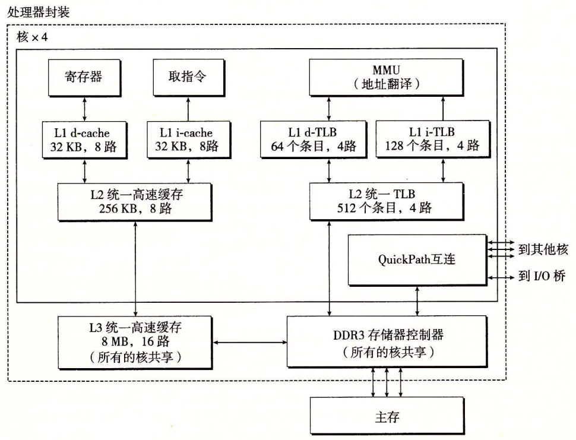
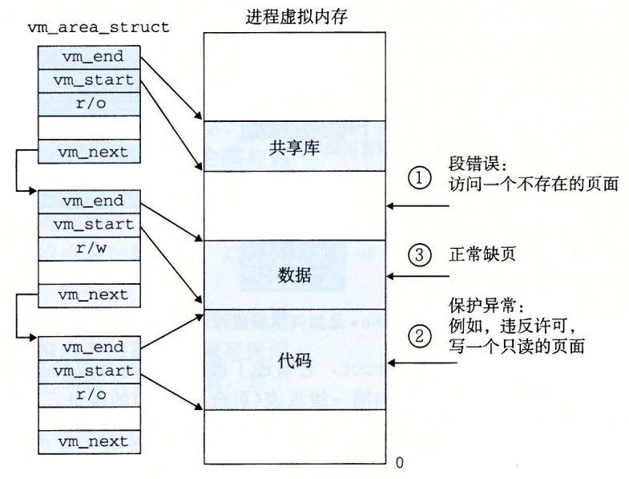

# 9.7 案例研究：Intel Core i7 / Linux 内存系统

我们以一个实际系统的案例研究来总结我们对虚拟内存的讨论：一个运行 Linux 的 Intel Core i7。虽然底层的 Haswell 微体系结构允许完全的 64 位虚拟和物理地址空间，而现在的（以及可预见的未来的）Core i7 实现支持 48 位（256 TB）虚拟地址空间和 52 位（4 PB）物理地址空间，还有一个兼容模式，支持 32 位（4 GB）虚拟和物理地址空间。

图 9-21 给出了 Corei7 内存系统的重要部分。**处理器封装**（processor package）包括四个核、一个大的所有核共享的 L3 高速缓存，以及一个 DDR3 内存控制器。每个核包含一个层次结构的 TLB、一个层次结构的数据和指令高速缓存，以及一组快速的点到点链路，这种链路基于 QuickPath 技术，是为了让一个核与其他核和外部 I/O 桥直接通信。TLB 是虚拟寻址的，是四路组相联的。L1、L2 和 L3 高速缓存是物理寻址的，块大小为 64 字节。L1 和 L2 是 8 路组相联的，而 L3 是 16 路组相联的。页大小可以在启动时被配置为 4 KB 或 4 MB。Linux 使用的是 4 KB 的页。

## 9.7.1 Core i7 地址翻译

图 9-22 总结了完整的 Core i7 地址翻译过程，从 CPU 产生虚拟地址的时刻一直到来自内存的数据字到达 CPU。Core i7 采用四级页表层次结构。每个进程有它自己私有的页表层次结构。当一个 Linux 进程在运行时，虽然 Core i7 体系结构允许页表换进换出，但是与已分配了的页相关联的页表都是驻留在内存中的。CR3 控制寄存器指向第一级页表（L1）的起始位置。CR3 的值是每个进程上下文的一部分，每次上下文切换时，CR3 的值都会被恢复。

图 9-23 给出了第一级、第二级或第三级页表中条目的格式。当 $$\small P=1$$ 时（Linux 中就总是如此），地址字段包含一个 40 位物理页号（PPN），它指向适当的页表的开始处。注意，这强加了一个要求，要求物理页表 4 KB 对齐。

图 9-24 给出了第四级页表中条目的格式。当$$\small P=1$$，地址字段包括一个 40 位 PPN，它指向物理内存中某一页的基地址。这又强加了一个要求，要求物理页 4 KB 对齐。

PTE 有三个权限位，控制对页的访问。R/W 位确定页的内容是可以读写的还是只读的。U/S 位确定是否能够在用户模式中访问该页，从而保护操作系统内核中的代码和数据不被用户程序访问。XD（禁止执行）位是在 64 位系统中引入的，可以用来禁止从某些内存页取指令。这是一个重要的新特性，通过限制只能执行只读代码段，使得操作系统内核降低了缓冲区溢出攻击的风险。

当 MMU 翻译每一个虚拟地址时，它还会更新另外两个内核缺页处理程序会用到的位。每次访问一个页时，MMU 都会设置 A 位，称为**引用位**（reference bit）。内核可以用这个引用位来实现它的页替换算法。每次对一个页进行了写之后，MMU 都会设置 D 位，又称修改位或脏位（dirty bit）。修改位告诉内核在复制替换页之前是否必须写回牺牲页。内核可以通过调用一条特殊的内核模式指令来清除引用位或修改位。

图 9-25 给出了 Core i7 MMU 如何使用四级的页表来将虚拟地址翻译成物理地址。36 位 VPN 被划分成四个 9 位的片，每个片被用作到一个页表的偏移量。CR3 寄存器包含 L1 页表的物理地址。VPN 1 提供到一个 L1 PTE 的偏移量，这个 PTE 包含 L2 页表的基地址。VPN 2 提供到一个 L2 PTE 的偏移量，以此类推。

> 图 9-25Corei7 页表翻译 
>
> （PT：页表，PTE：页表条目，VPN：虚拟页号，VPO：虚拟页偏移，PPN：物理页号，PPO：物理页偏移量。图中还给出了这四级页表的 Linux 名字）


### 旁注 - 优化地址翻译

在对地址翻译的讨论中，我们描述了一个顺序的两个步骤的过程，1）MMU 将虚拟地址翻译成物理地址，2）将物理地址传送到 L1 高速缓存。然而，实际的硬件实现使用了一个灵活的技巧，允许这些步骤部分重叠，因此也就加速了对 L1 高速缓存的访问。例如，页面大小为 4KB 的 Corei7 系统上的一个虚拟地址有 12 位的 VPO，并且这些位和相应物理地址中的 PPO 的 12 位是相同的。因为八路组相联的、物理寻址的 L1 高速缓存有 64 个组和大小为 64 字节的缓存块，每个物理地址有 6 个（$$\rm log_264$$）缓存偏移位和 6 个（$$\rm log_264$$）索引位。这 12 位恰好符合虚拟地址的 VPO 部分，这绝不是偶然！当 CPU 需要翻译一个虚拟地址时，它就发送 VPN 到 MMU，发送 VPO 到高速 L1 缓存。当 MMU 向 TLB 请求一个页表条目时，L1 高速缓存正忙着利用 VPO 位查找相应的组，并读出这个组里的 8 个标记和相应的数据字。当 MMU 从 TLB 得到 PPN 时，缓存已经准备好试着把这个 PPN 与这 8 个标记中的一个进行匹配了。


## 9.7.2 Linux 虚拟内存系统

一个虚拟内存系统要求硬件和内核软件之间的紧密协作。版本与版本之间细节都不尽相同，对此完整的阐释超出了我们讨论的范围。但是，在这一小节中我们的目标是对 Linux 的虚拟内存系统做一个描述，使你能够大致了解一个实际的操作系统是如何组织虚拟内存，以及如何处理缺页的。

Linux 为每个进程维护了一个单独的虚拟地址空间，形式如图 9-26 所示。我们已经多次看到过这幅图了，包括它那些熟悉的代码、数据、堆、共享库以及栈段。既然我们理解了地址翻译，就能够填入更多的关于内核虚拟内存的细节了，这部分虚拟内存位于用户栈之上。

内核虚拟内存包含内核中的代码和数据结构。内核虚拟内存的某些区域被映射到所有进程共享的物理页面。例如，每个进程共享内核的代码和全局数据结构。有趣的是，Linux 也将一组连续的虚拟页面（大小等于系统中 DRAM 的总量）映射到相应的一组连续的物理页面。这就为内核提供了一种便利的方法来访问物理内存中任何特定的位置，例如，当它需要访问页表，或在一些设备上执行内存映射的 I/。操作，而这些设备被映射到特定的物理内存位置时。

内核虚拟内存的其他区域包含每个进程都不相同的数据。比如说，页表、内核在进程的上下文中执行代码时使用的栈，以及记录虚拟地址空间当前组织的各种数据结构。

### 1. Linux 虚拟内存区域

Linux 将虚拟内存组织成一些区域（也叫做段）的集合。一个区域（area）就是已经存在着的（已分配的）虚拟内存的连续片（chunk），这些页是以某种方式相关联的。例如，代码段、数据段、堆、共享库段，以及用户栈都是不同的区域。每个存在的虚拟页面都保存在某个区域中，而不属于某个区域的虚拟页是不存在的，并且不能被进程引用。区域的概念很重要，因为它允许虚拟地址空间有间隙。内核不用记录那些不存在的虚拟页，而这样的页也不占用内存、磁盘或者内核本身中的任何额外资源。

图 9-27 强调了记录一个进程中虚拟内存区域的内核数据结构。内核为系统中的每个进程维护一个单独的任务结构（源代码中的 task\_struct）。任务结构中的元素包含或者指向内核运行该进程所需要的所有信息（例如，PID、指向用户栈的指针、可执行目标文件的名字，以及程序计数器）。

任务结构中的一个条目指向 mm\_struct，它描述了虚拟内存的当前状态。我们感兴趣的两个字段是 pgd 和 mmap，其中 pgd 指向第一级页表（页全局目录）的基址，而 mmap 指向一个 vm\_area\_structs（区域结构）的链表，其中每个 vm\_area\_structs 都描述了当前虚拟地址空间的一个区域。当内核运行这个进程时，就将 pgd 存放在 CR3 控制寄存器中。

为了我们的目的，一个具体区域的区域结构包含下面的字段：

* vm\_start：指向这个区域的起始处。
* vm\_end：指向这个区域的结束处。
* vm\_prot：描述这个区域内包含的所有页的读写许可权限。
* vm\_flags：描述这个区域内的页面是与其他进程共享的，还是这个进程私有的（还描述了其他一些信息）。
* vm\_next：指向链表中下—区域结构。

### 2. Linux 缺页异常处理

假设 MMU 在试图翻译某个虚拟地址 A 时，触发了一个缺页。这个异常导致控制转移到内核的缺页处理程序，处理程序随后就执行下面的步骤：

1. **虚拟地址 A 是合法的吗？**换句话说，A 在某个区域结构定义的区域内吗？为了回答这个问题，缺页处理程序搜索区域结构的链表，把 A 和每个区域结构中的 vm\_start 和 vm\_end 做比较。如果这个指令是不合法的，那么缺页处理程序就触发一个段错误，从而终止这个进程。这个情况在图 9-28 中标识为 “1”。

   因为一个进程可以创建任意数量的新虚拟内存区域（使用在下一节中描述的 mmap 函数），所以顺序搜索区域结构的链表花销可能会很大。因此在实际中，Linux 使用某些我们没有显示出来的字段，Linux 在链表中构建了一棵树，并在这棵树上进行查找。

2. **试图进行的内存访问是否合法？**换句话说，进程是否有读、写或者执行这个区域内页面的权限？例如，这个缺页是不是由一条试图对这个代码段里的只读页面进行写操作的存储指令造成的？这个缺页是不是因为一个运行在用户模式中的进程试图从内核虚拟内存中读取字造成的？如果试图进行的访问是不合法的，那么缺页处理程序会触发一个保护异常，从而终止这个进程。这种情况在图 9-28 中标识为 “2”。
3. **此刻，内核知道了这个缺页是由于对合法的虚拟地址进行合法的操作造成的。**它是这样来处理这个缺页的：选择一个牺牲页面，如果这个牺牲页面被修改过，那么就将它交换出去，换入新的页面并更新页表。当缺页处理程序返回时，CPU 重新启动引起缺页的指令，这条指令将再次发送 A 到 MMU。这次，MMU 就能正常地翻译 A，而不会再产生缺页中断了。

