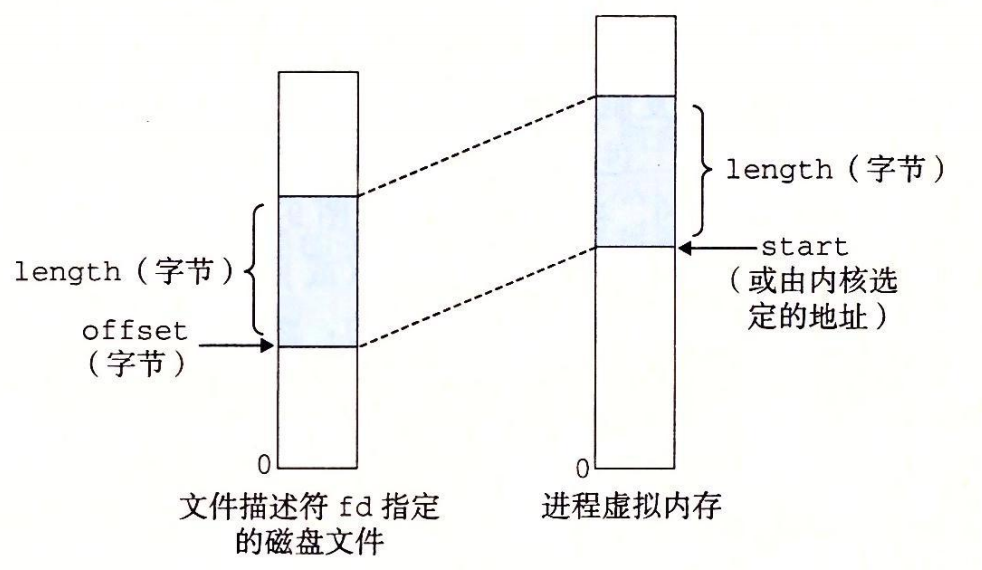

# 9.8 内存映射

Linux 通过将一个虚拟内存区域与一个磁盘上的**对象**（object）关联起来，以初始化这个虚拟内存区域的内容，这个过程称为**内存映射**（memory mapping），虚拟内存区域可以映射到两种类型的对象中的一种：

1. **Linux 文件系统中的普通文件：**一个区域可以映射到一个普通磁盘文件的连续部分，例如一个可执行目标文件。文件区（section）被分成页大小的片，每一片包含一个虚拟页面的初始内容。因为按需进行页面调度，所以这些虚拟页面没有实际交换进入物理内存，直到 CPU 第一次引用到页面（即发射一个虚拟地址，落在地址空间这个页面的范围之内）。如果区域比文件区要大，那么就用零来填充这个区域的余下部分。
2. **匿名文件：**一个区域也可以映射到一个匿名文件，匿名文件是由内核创建的，包含的全是二进制零。CPU 第一次引用这样一个区域内的虚拟页面时，内核就在物理内存中找到一个合适的牺牲页面，如果该页面被修改过，就将这个页面换出来，用二进制零覆盖牺牲页面并更新页表，将这个页面标记为是驻留在内存中的。注意在磁盘和内存之间并没有实际的数据传送。因为这个原因，映射到匿名文件的区域中的页面有时也叫做请**求二进制零的页**（demand-zero page）。

无论在哪种情况中，一旦一个虚拟页面被初始化了，它就在一个由内核维护的专门的**交换文件**（swap file）之间换来换去。交换文件也叫做**交换空间**（swap space）或者**交换区域**（swap area）。需要意识到的很重要的一点是，在任何时刻，交换空间都限制着当前运行着的进程能够分配的虚拟页面的总数。

## 9.8.1 再看共享对象

内存映射的概念来源于一个聪明的发现：如果虚拟内存系统可以集成到传统的文件系统中，那么就能提供一种简单而高效的把程序和数据加载到内存中的方法。

正如我们已经看到的，进程这一抽象能够为每个进程提供自己私有的虚拟地址空间，可以免受其他进程的错误读写。不过，许多进程有同样的只读代码区域。例如，每个运行 Linux shell 程序 bash 的进程都有相同的代码区域。而且，许多程序需要访问只读运行时库代码的相同副本。例如，每个 C 程序都需要来自标准 C 库的诸如 printf 这样的函数。那么，如果每个进程都在物理内存中保持这些常用代码的副本，那就是极端的浪费了。幸运的是，内存映射给我们提供了一种清晰的机制，用来控制多个进程如何共享对象。

一个对象可以被映射到虚拟内存的一个区域，要么作为共享对象，要么作为私有对象。如果一个进程将一个共享对象映射到它的虚拟地址空间的一个区域内，那么这个进程对这个区域的任何写操作，对于那些也把这个共享对象映射到它们虚拟内存的其他进程而言，也是可见的。而且，这些变化也会反映在磁盘上的原始对象中。

另一方面，对于一个映射到私有对象的区域做的改变，对于其他进程来说是不可见的，并且进程对这个区域所做的任何写操作都不会反映在磁盘上的对象中。一个映射到共享对象的虚拟内存区域叫做**共享区域**。类似地，也有**私有区域**。

假设进程 1 将一个共享对象映射到它的虚拟内存的一个区域中，如图 9-29a 所示。现在假设进程 2 将同一个共享对象映射到它的地址空间（并不一定要和进程 1 在相同的虚拟地址处，如图 9-29b 所示）。


因为每个对象都有一个唯一的文件名，内核可以迅速地判定进程 1 已经映射了这个对象，而且可以使进程 2 中的页表条目指向相应的物理页面。关键点在于即使对象被映射到了多个共享区域，物理内存中也只需要存放共享对象的一个副本。为了方便，我们将物理页面显示为连续的，但是在一般情况下当然不是这样的。

私有对象使用一种叫做**写时复制**（copy-on-write）的巧妙技术被映射到虚拟内存中。一个私有对象开始生命周期的方式基本上与共享对象的一样，在物理内存中只保存有私有对象的一份副本。比如，图 9-30a 展示了一种情况，其中两个进程将一个私有对象映射到它们虚拟内存的不同区域，但是共享这个对象同一个物理副本。对于每个映射私有对象的进程，相应私有区域的页表条目都被标记为只读，并且区域结构被标记为私有的写时复制。只要没有进程试图写它自己的私有区域，它们就可以继续共享物理内存中对象的一个单独副本。然而，只要有一个进程试图写私有区域内的某个页面，那么这个写操作就会触发一个保护故障。


当故障处理程序注意到保护异常是由于进程试图写私有的写时复制区域中的一个页面而引起的，它就会在物理内存中创建这个页面的一个新副本，更新页表条目指向这个新的副本，然后恢复这个页面的可写权限，如图 9-30b 所示。当故障处理程序返回时，CPU 重新执行这个写操作，现在在新创建的页面上这个写操作就可以正常执行了。

通过延迟私有对象中的副本直到最后可能的时刻，写时复制最充分地使用了稀有的物理内存。

## 9.8.2 再看 fork 函数

既然我们理解了虚拟内存和内存映射，那么我们可以清晰地知道 fork 函数是如何创建一个带有自己独立虚拟地址空间的新进程的。

当 fork 函数被当前进程调用时，内核为新进程创建各种数据结构，并分配给它一个唯一的 PID。为了给这个新进程创建虚拟内存，它创建了当前进程的 mm\_struct、区域结构和页表的原样副本。它将两个进程中的每个页面都标记为只读，并将两个进程中的每个区域结构都标记为私有的写时复制。

当 fork 在新进程中返回时，新进程现在的虚拟内存刚好和调用 fork 时存在的虚拟内存相同。当这两个进程中的任一个后来进行写操作时，写时复制机制就会创建新页面，因此，也就为每个进程保持了私有地址空间的抽象概念。

## 9.8.3 再看 execve 函数

虚拟内存和内存映射在将程序加载到内存的过程中也扮演着关键的角色。既然已经理解了这些概念，我们就能够理解 execve 函数实际上是如何加载和执行程序的。假设运行在当前进程中的程序执行了如下的 execve 调用：

```c
execve("a.out", NULL, NULL);
```

正如在第 8 章中学到的，execve 函数在当前进程中加载并运行包含在可执行目标文件 a.out 中的程序，用 a.out 程序有效地替代了当前程序。加载并运行 a.out 需要以下几个步骤：

1. **删除已存在的用户区域。**删除当前进程虚拟地址的用户部分中的已存在的区域结构。
2. **映射私有区域。**为新程序的代码、数据、bss 和栈区域创建新的区域结构。所有这些新的区域都是私有的、写时复制的。代码和数据区域被映射为 a.out 文件中的. text 和. data 区。bss 区域是请求二进制零的，映射到匿名文件，其大小包含在 a.out 中。栈和堆区域也是请求二进制零的，初始长度为零。图 9-31 概括了私有区域的不同映射。
3. **映射共享区域。**如果 a.out 程序与共享对象（或目标）链接，比如标准 C 库 libc.so，那么这些对象都是动态链接到这个程序的，然后再映射到用户虚拟地址空间中的共享区域内。
4. **设置程序计数器（PC）。**execve 做的最后一件事情就是设置当前进程上下文中的程序计数器，使之指向代码区域的入口点。


下一次调度这个进程时，它将从这个入口点开始执行。Linux 将根据需要换入代码和数据页面。

```c
#include <unistd.h>
#include <sys/mman.h>

void *mmap(void *start, size_t length, int prot, int flags,
           int fd, off_t offset);

// 返回：若成功时则为指向映射区域的指针，若出错则为 MAP_FAILED(-1)。
```

mmap 函数要求内核创建一个新的虚拟内存区域，最好是从地址 start 开始的一个区域，并将文件描述符 fd 指定的对象的一个连续的片（chunk）映射到这个新的区域。连续的对象片大小为 length 字节，从距文件开始处偏移量为 offset 字节的地方开始。start 地址仅仅是一个暗示，通常被定义为 NULL。为了我们的目的，我们总是假设起始地址为 NULL。图 9-32 描述了这些参数的意义。



参数 prot 包含描述新映射的虚拟内存区域的访问权限位（即在相应区域结构中的 vm\_prot 位）。

* **PROT\_EXEC：**这个区域内的页面由可以被 CPU 执行的指令组成。
* **PROT\_READ：**这个区域内的页面可读。
* **PROT\_WRITE：**这个区域内的页面可写。
* **PROT\_NONE：**这个区域内的页面不能被访问。

参数 flags 由描述被映射对象类型的位组成。如果设置了 MAP\_ANON 标记位，那么被映射的对象就是一个匿名对象，而相应的虚拟页面是请求二进制零的。MAP\_PRI-VATE 表示被映射的对象是一个私有的、写时复制的对象，而 MAP\_SHARED 表示是一个共享对象。例如

```c
bufp = Mmap(NULL, size, PROT_READ, MAP_PRIVATE|MAP_ANON, 0, 0);
```

让内核创建一个新的包含 size 字节的只读、私有、请求二进制零的虚拟内存区域。如果调用成功，那么 bufp 包含新区域的地址。

munmap 函数删除虚拟内存的区域：

```c
#include <unistd.h>
#include <sys/mman.h>

int munmap(void *start, size_t length);

// 返回：若成功则为 0，若出错则为 -1。
```

munmap 函数删除从虚拟地址 start 开始的，由接下来 length 字节组成的区域。接下来对已删除区域的引用会导致段错误。

### 练习题 9.5



编写一个 C 程序 mmapcopy.c，使用 mmap 将一个任意大小的磁盘文件复制到 stdouto 输入文件的名字必须作为一个命令行参数来传递。





解决这个题目将帮助你很好地理解内存映射。请自己独立完成这道题。我们没有讨论 open、fstat 或者 write 函数，所以你需要阅读它们的帮助页来看看它们是如何工作的。


```c
#include "csapp.h"

/*
* mmapcopy - uses mmap to copy file fd to stdout
*/
void mmapcopy(int fd, int size)
{
    char *bufp; /* ptr to memory-mapped VM area */

    bufp = Mmap(NULL, size, PROT_READ, MAP_PRIVATE, fd, 0);
    Write(1, bufp, size);
    return;
}

/* mmapcopy driver */
int main(int argc, char **argv)
{
    struct stat stat;
    int fd;

    /* Check for required command-line argument */
    if (argc != 2) {
        printf("usage: %s <filename>\n", argv[0]);
        exit(0);
    }

    /* Copy the input argument to stdout */
    fd = Open(argv[1], O_RDONLY, 0);
    fstat(fd, &stat);
    mmapcopy(fd, stat.st_size);
    exit(0);
}
```




