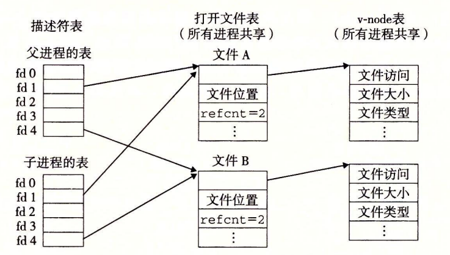

# 10.8 共享文件

可以用许多不同的方式来共享 Linux 文件。除非你很清楚内核是如何表示打开的文件，否则文件共享的概念相当难懂。内核用三个相关的数据结构来表示打开的文件：

* **描述符表**（descriptor table）。每个进程都有它独立的描述符表，它的表项是由进程打开的文件描述符来索引的。每个打开的描述符表项指向文件表中的一个表项。
* **文件表**（file table）。打开文件的集合是由一张文件表来表示的，所有的进程共享这张表。每个文件表的表项组成（针对我们的目的）包括当前的文件位置、**引用计数**（reference count）（即当前指向该表项的描述符表项数），以及一个指向 v-node 表中对应表项的指针。关闭一个描述符会减少相应的文件表表项中的引用计数。内核不会删除这个文件表表项，直到它的引用计数为零。
* **v-node 表**（v-node table）。同文件表一样，所有的进程共享这张 v-node 表。每个表项包含 stat 结构中的大多数信息，包括 st\_mode 和 st\_size 成员。

图 10-12 展示了一个示例，其中描述符 1 和 4 通过不同的打开文件表表项来引用两个不同的文件。这是一种典型的情况，没有共享文件，并且每个描述符对应一个不同的文件。


> 图 10-12 典型的打开文件的内核数据结构。在这个示例中，两个描述符引用不同的文件。没有共享

如图 10-13 所示，多个描述符也可以通过不同的文件表表项来引用同一个文件。例如，如果以同一个 filename 调用 open 函数两次，就会发生这种情况。关键思想是每个描述符都有它自己的文件位置，所以对不同描述符的读操作可以从文件的不同位置获取数据。


> 图 10-13 文件共享。这个例子展示了两个描述符通过两个打开文件表表项共享同一个磁盘文件

我们也能理解父子进程是如何共享文件的。假设在调用 fork 之前，父进程有如图 10-12 所示的打开文件。然后，图 10-14 展示了调用 fork 后的情况。子进程有一个父进程描述符表的副本。父子进程共享相同的打开文件表集合，因此共享相同的文件位置。一个很重要的结果就是，在内核删除相应文件表表项之前，父子进程必须都关闭了它们的描述符。



### 练习题 10.2



假设磁盘文件 foobar.txt 由 6 个 ASCII 码字符 “foobar” 组成。那么，下列程序的输出是什么？

```c
#include "csapp.h"

int main()
{
    int fd1, fd2;
    char c;

    fd1 = Open("foobar.txt", O_RDONLY, 0);
    fd2 = Open("foobar.txt", O_RDONLY, 0);
    Read(fd1, &c, 1);
    Read(fd2, &c, 1);
    printf("c = %c\n", c);
    exit(0);
}
```





描述符 fd1 和 fd2 都有各自的打开文件表表项，所以每个描述符对于 foobar.txt 都有它自己的文件位置。因此，从 fd2 的读操作会读取 foobar.txt 的第一个字节，并输出

**c = f**

而不是像你开始可能想的

**c = o**



### 练习题 10.3



就像前面那样，假设磁盘文件 foobar.txt 由 6 个 ASCII 码字符 “foobar” 那么下列程序的输出是什么？

```c
#include "csapp.h"

int main()
{
    int fd;
    char c;

    fd = Open("foobar.txt", O_RDONLY, 0);
    if (Fork() == 0) {
        Read(fd, &c, 1);
        exit(0);
    }
    Wait(NULL);
    Read(fd, &c, 1);
    printf("c = %c\n", c);
    exit(0);
}
```





回想一下，子进程会继承父进程的描述符表，以及所有进程共享的同一个打开文件表。因此，描述符 fd 在父子进程中都指向同一个打开文件表表项。当子进程读取文件的第一个字节时，文件位置加 1。因此，父进程会读取第二个字节，而输出就是

**c = o**



