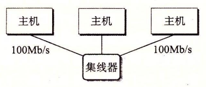
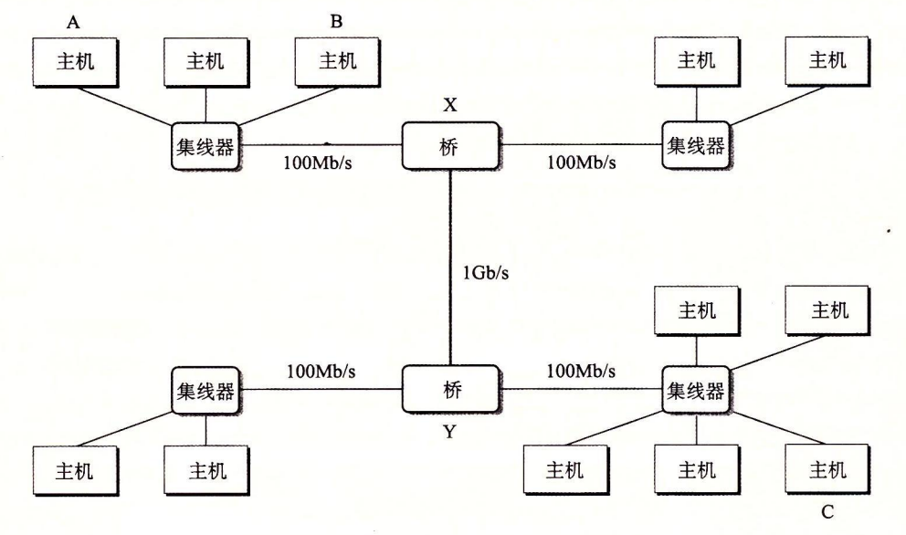

# 11.2 网络

客户端和服务器通常运行在不同的主机上，并且通过**计算机网络**的硬件和软件资源来通信。网络是很复杂的系统，在这里我们只想了解一点皮毛。我们的目标是从程序员的角度给你一个切实可行的思维模型。

对主机而言，网络只是又一种 I/O 设备，是数据源和数据接收方，如图 11-2 所示。

一个插到 I/O 总线扩展槽的适配器提供了到网络的物理接口。从网络上接收到的数据从适配器经过 I/O 和内存总线复制到内存，通常是通过 DMA 传送。相似地，数据也能从内存复制到网络。

物理上而言，网络是一个按照地理远近组成的层次系统。最低层是 LAN（Local Area Network，局域网），在一个建筑或者校园范围内。迄今为止，最流行的局域网技术是**以太网**（Ethernet），它是由施乐公司帕洛阿尔托研究中心（Xerox PARC）在 20 世纪 70 年代中期提出的。以太网技术被证明是适应力极强的，从 3 Mb/s 演变到 10 Gb/s。

一个**以太网段**（Ethernet segment）包括一些电缆（通常是双绞线）和一个叫做**集线器**的小盒子，如图 11-3 所示。以太网段通常跨越一些小的区域，例如某建筑物的一个房间或者一个楼层。每根电缆都有相同的最大位带宽，通常是 100 Mb/s 或者 1 Gb/s。

一端连接到主机的适配器，而另一端则连接到集线器的一个端口上。集线器不加分辨地将从一个端口上收到的每个位复制到其他所有的端口上。因此，每台主机都能看到每个位。

每个以太网适配器都有一个全球唯一的 48 位地址，它存储在这个适配器的非易失性存储器上。一台主机可以发送一段位（称为**帧**（frame））到这个网段内的其他任何主机。每个帧包括一些固定数量的**头部**（header）位，用来标识此帧的源和目的地址以及此帧的长度，此后紧随的就是数据位的**有效载荷**（payload）。每个主机适配器都能看到这个帧，但是只有目的主机实际读取它。

使用一些电缆和叫做**网桥**（bridge）的小盒子，多个以太网段可以连接成较大的局域网，称为**桥接以太网**（bridged Ethernet），如图 11-4 所示。桥接以太网能够跨越整个建筑物或者校区。在一个桥接以太网里，一些电缆连接网桥与网桥，而另外一些连接网桥和集线器。这些电缆的带宽可以是不同的。在我们的示例中，网桥与网桥之间的电缆有 1 Gb/s 的带宽，而四根网桥和集线器之间电缆的带宽却是 100 Mb/s。

网桥比集线器更充分地利用了电缆带宽。利用一种聪明的分配算法，它们随着时间自动学习哪个主机可以通过哪个端口可达，然后只在有必要时，有选择地将帧从一个端口复制到另一个端口。例如，如果主机 A 发送一个帧到同网段上的主机 B，当该帧到达网桥 X 的输入端口时，X 就将丢弃此帧，因而节省了其他网段上的带宽。然而，如果主机 A 发送一个帧到一个不同网段上的主机 C，那么网桥 X 只会把此帧复制到和网桥 Y 相连的端口上，网桥 Y 会只把此帧复制到与主机 C 的网段连接的端口。

为了简化局域网的表示，我们将把集线器和网桥以及连接它们的电缆画成一根水平线，如图 11-5 所示。

在层次的更高级别中，多个不兼容的局域网可以通过叫做**路由器**（router）的特殊计算机连接起来，组成一个 internet（互联网络）。每台路由器对于它所连接到的每个网络都有一个适配器（端口）。路由器也能连接高速点到点电话连接，这是称为 WAN（Wide-Area Network，广域网）的网络示例，之所以这么叫是因为它们覆盖的地理范围比局域网的大。一般而言，路由器可以用来由各种局域网和广域网构建互联网络。例如，图 11-6 展示了一个互联网络的示例，3 台路由器连接了一对局域网和一对广域网。


### 旁注 - Internet 和 internet

我们总是用小写字母的 internet 描述一般概念，而用大写字母的 Internet 来描述一种具体的实现，也就是所谓的全球 IP 因特网。


互联网络至关重要的特性是，它能由采用完全不同和不兼容技术的各种局域网和广域网组成。每台主机和其他每台主机都是物理相连的，但是如何能够让某台源主机跨过所有这些不兼容的网络发送数据位到另一台目的主机呢？

解决办法是一层运行在每台主机和路由器上的协议软件，它消除了不同网络之间的差异。这个软件实现一种协议，这种协议控制主机和路由器如何协同工作来实现数据传输。这种协议必须提供两种基本能力：

* **命名机制。**不同的局域网技术有不同和不兼容的方式来为主机分配地址。互联网络协议通过定义一种一致的主机地址格式消除了这些差异。每台主机会被分配至少一个这种互联网络地址（internetaddress），这个地址唯一地标识了这台主机。
* **传送机制。**在电缆上编码位和将这些位封装成帧方面，不同的联网技术有不同的和不兼容的方式。互联网络协议通过定义一种把数据位捆扎成不连续的片（称为包）的统一方式，从而消除了这些差异。一个包是由包头和有效载荷组成的，其中包头包括包的大小以及源主机和目的主机的地址，有效载荷包括从源主机发出的数据位。

图 11-7 展示了主机和路由器如何使用互联网络协议在不兼容的局域网间传送数据的一个示例。这个互联网络示例由两个局域网通过一台路由器连接而成。一个客户端运行在主机 A 上，主机 A 与 LAN1 相连，它发送一串数据字节到运行在主机 B 上的服务器端，主机 B 则连接在 LAN2 上。

> 图 11-7 在互联网络上，数据是如何从一台主机传送到另一台主机的
>
> （PH：互联网络包头；FH1：LAN1 的帧头；FH2：LAN2 的帧头）

这个过程有 8 个基本步骤：

1. 运行在主机 A 上的客户端进行一个系统调用，从客户端的虚拟地址空间复制数据到内核缓冲区中。
2. 主机 A 上的协议软件通过在数据前附加互联网络包头和 LAN1 帧头，创建了一个 LAN1 的帧。互联网络包头寻址到互联网络主机 B。LAN1 帧头寻址到路由器。然后它传送此帧到适配器。注意，LAN1 帧的有效载荷是一个互联网络包，而互联网络包的有效载荷是实际的用户数据。这种封装是基本的网络互联方法之一。
3. LAN1 适配器复制该帧到网络上。
4. 当此帧到达路由器时，路由器的 LAN1 适配器从电缆上读取它，并把它传送到协议软件。
5. 路由器从互联网络包头中提取出目的互联网络地址，并用它作为路由表的索引，确定向哪里转发这个包，在本例中是 LAN2。路由器剥落旧的 LAN1 的帧头，加上寻址到主机 B 的新的 LAN2 帧头，并把得到的帧传送到适配器。
6. 路由器的 LAN2 适配器复制该帧到网络上。
7. 当此帧到达主机 B 时，它的适配器从电缆上读到此帧，并将它传送到协议软件。
8. 最后，主机 B 上的协议软件剥落包头和帧头。当服务器进行一个读取这些数据的系统调用时，协议软件最终将得到的数据复制到服务器的虚拟地址空间。

当然，在这里我们掩盖了许多很难的问题。如果不同的网络有不同帧大小的最大值，该怎么办呢？路由器如何知道该往哪里转发帧呢？当网络拓扑变化时，如何通知路由器？如果一个包丢失了又会如何呢？虽然如此，我们的示例抓住了互联网络思想的精髓，封装是关键。

