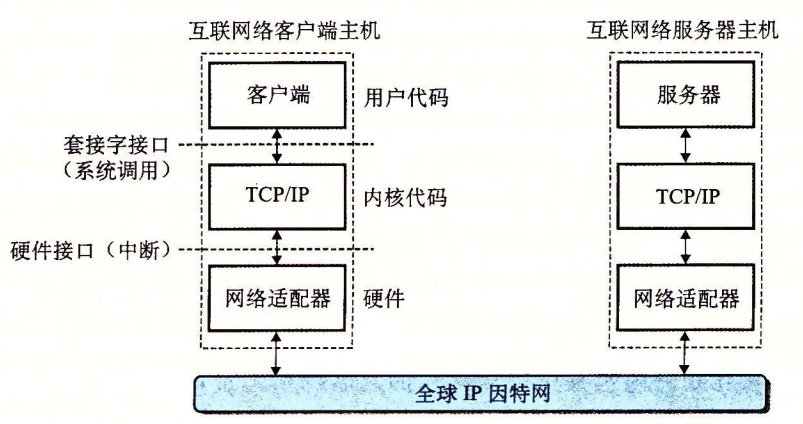
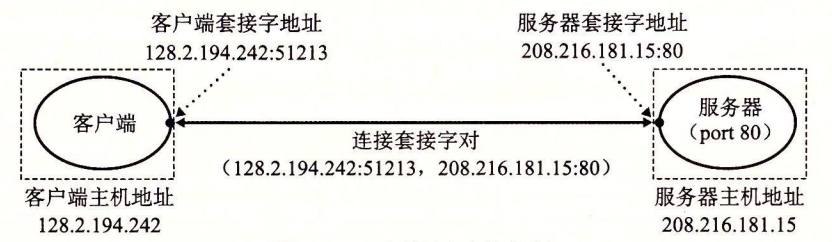

# 11.3 全球 IP 因特网

全球 IP 因特网是最著名和最成功的互联网络实现。从 1969 年起，它就以这样或那样的形式存在了。虽然因特网的内部体系结构复杂而且不断变化，但是自从 20 世纪 80 年代早期以来，客户端 - 服务器应用的组织就一直保持着相当的稳定。图 11-8 展示了一个因特网客户端—服务器应用程序的基本硬件和软件组织。



每台因特网主机都运行实现 TCP/IP 协议（Transmission Control Protocol / Internet Protocol，传输控制协议/互联网络协议）的软件，几乎每个现代计算机系统都支持这个协议。因特网的客户端和服务器混合使用**套接字接口**函数和 Unix l/O 函数来进行通信（我们将在 11.4 节中介绍套接字接口）。通常将套接字函数实现为系统调用，这些系统调用会陷入内核，并调用各种内核模式的 TCP/IP 函数。

TCP/IP 实际是一个协议族，其中每一个都提供不同的功能。例如，IP 协议提供基本的命名方法和递送机制，这种递送机制能够从一台因特网主机往其他主机发送包，也叫做**数据报**（datagram）。IP 机制从某种意义上而言是不可靠的，因为，如果数据报在网络中丢失或者重复，它并不会试图恢复。UDP（Unreliable Datagram Protocol，不可靠数据报协议）稍微扩展了 IP 协议，这样一来，包可以在进程间而不是在主机间传送。TCP 是一个构建在 IP 之上的复杂协议，提供了进程间可靠的全双工（双向的）连接。为了简化讨论，我们将 TCP/IP 看做是一个单独的整体协议。我们将不讨论它的内部工作，只讨论 TCP 和 IP 为应用程序提供的某些基本功能。我们将不讨论 UDP。

从程序员的角度，我们可以把因特网看做一个世界范围的主机集合，满足以下特性：

* 主机集合被映射为一组 32 位的 **IP 地址**。
* 这组 IP 地址被映射为一组称为**因特网域名**（Internet domain name）的标识符。
* 因特网主机上的进程能够通过**连接**（connection）和任何其他因特网主机上的进程通信。

接下来三节将更详细地讨论这些基本的因特网概念。


### 旁注 - IPv4 和 IPv6

最初的因特网协议，使用 32 位地址，称为因特网协议版本 4（Internet Protocol Version 4，IPv4）01996 年，因特网工程任务组织（Internet Engineering Task Force，IETF）提出了一个新版本的 IP，称为因特网协议版本 6（IPv6），它使用的是 128 位地址，意在替代 IPv4。但是直到 2015 年，大约 20 年后，因特网流量的绝大部分还是由 IPv4 网络承载的。例如，只有 4% 的访问 Google 服务的用户使用 IPv6【42】。

因为 IPv6 的使用率较低，本书不会讨论 IPv6 的细节，而只是集中注意力于 IPv4 背后的概念。当我们谈论因特网时，我们指的是基于 IPv4 的因特网。但是，本章后面介绍的书写客户端和服务器的技术是基于现代接口的，与任何特殊的协议无关。


## 11.3.1 IP 地址

一个 IP 地址就是一个 32 位无符号整数。网络程序将 IP 地址存放在如图 11-9 所示的 **IP 地址结构**中。



```c
/* IP address structure */
struct in_addr {
    uint32_t s_addr; /* Address in network byte order (big-endian) */
};
```



> 图 11-9 IP 地址结构

把一个标量地址存放在结构中，是套接字接口早期实现的不幸产物。为 IP 地址定义一个标量类型应该更有意义，但是现在更改已经太迟了，因为已经有大量应用是基于此的。

因为因特网主机可以有不同的主机字节顺序，TCP/IP 为任意整数数据项定义了统一的**网络字节顺序**（network byte order）（大端字节顺序），例如 IP 地址，它放在包头中跨过网络被携带。在 IP 地址结构中存放的地址总是以（大端法）网络字节顺序存放的，即使主机字节顺序（host byte order）是小端法。Unix 提供了下面这样的函数在网络和主机字节顺序间实现转换。

```c
#include <arpa/inet.h>

uint32_t htonl(uint32_t hostlong);
uint16_t htons(uint16_t hostshort);
// 返回：按照网络字节顺序的值。

uint32_t ntohl(uint32_t netlong);
uint16_t ntohs(unit16_t netshort);
// 返回：按照主机字节顺序的值。
```

hotnl 函数将 32 位整数由主机字节顺序转换为网络字节顺序。ntohl 函数将 32 位整数从网络字节顺序转换为主机字节。htons 和 ntohs 函数为 16 位无符号整数执行相应的转换。注意，没有对应的处理 64 位值的函数。

IP 地址通常是以一种称为**点分十进制表示法**来表示的，这里，每个字节由它的十进制值表示，并且用句点和其他字节间分开。例如，128.2.194.242 就是地址 0x8002c2f2 的点分十进制表示。在 Linux 系统上，你能够使用 HOSTNAME 命令来确定你自己主机的点分十进制地址：

```c
linux> hostname -i
128.2.210.175
```

应用程序使用 inet\_pton 和 inet\_ntop 函数来实现 IP 地址和点分十进制串之间的转换。

```c
#include <arpa/inet.h>

int inet_pton(AF_INET, const char *src, void *dst);
// 返回：若成功则为 1，若 src 为非法点分十进制地址则为 0，若出错则为 -1。

const char *inet_ntop(AF_INET, const void *src, char *dst,
socklen_t size);
// 返回：若成功则指向点分十进制字符串的指针，若出错则为 NULL。
```

在这些函数名中，“n” 代表网络，“p” 代表表示。它们可以处理 32 位 IPv4 地址（AF\_INET）（就像这里展示的那样），或者 128 位 IPv6 地址（AF\_INET6）（这部分我们不讲）。

inet\_pton 函数将一个点分十进制串（src）转换为一个二进制的网络字节顺序的 IP 地址（dst）o 如果 src 没有指向一个合法的点分十进制字符串，那么该函数就返回 0。任何其他错误会返回 -1，并设置 errno。相似地，inet\_ntop 函数将一个二进制的网络字节顺序的 IP 地址（src）转换为它所对应的点分十进制表示，并把得到的以 null 结尾的字符串的最多 size 个字节复制到 dst。

### 练习题 11.1



完成下表：

| 十六进制地址 | 点分十进制地址 |
| :--- | :--- |
| 0x0 |  |
| 0xffffffff |  |
| 0x7f000001 |  |
|  | 205.188.160.121 |
|  | 64.12.149.13 |
|  | 205.188.146.23 |





| 十六进制地址 | 点分十进制地址 |
| :--- | :--- |
| 0x0 | 0.0.0.0 |
| 0xffffffff | 255.255.255.255 |
| 0x7f000001 | 127.0.0.1 |
| 0xcdbca079 | 205.188.160.121 |
| 0x400c950d | 64.12.149.13 |
| 0xcdbc9217 | 205.188,146.23 |



### 练习题 11.2



编写程序 hex2dd.c，将它的十六进制参数转换为点分十进制串并打印出结果。例如

```c
linux> ./hex2dd 0x8002c2f2
128.2.194.242
```






```c
#include "csapp.h"

int main(int argc, char**argv)
{
    struct in_addr inaddr;  /* Address in network byte order */
    uint32_t addr;          /* Address in host byte order */
    char buf[MAXBUF];       /* Buffer for dotted-decimal string */

    if (argc != 2) {
        fprintf(stderr, "usage: %s <hex number>\n", argv[0]);
        exit(0);
    }
    sscanf(argv[1], "%x", &addr);
    inaddr.s_addr = htonl(addr);

    if (!inet_ntop(AF_INET, &inaddr, buf, MAXBUF))
        unix_error("inet_ntop" );
    printf("%s\n", buf);

    exit(0);
}
```




### 练习题 11.3



编写程序 dd2hex.c，将它的点分十进制参数转换为十六进制数并打印出结果。例如

```c
linux> ./dd2hex 128.2.194.242
0x8002c2f2
```






```c
#include "csapp.h"

int main(int argc, char **argv)
{
    struct in_addr inaddr;/* Address in network byte order */
    int rc;
    
    if (argc != 2) {
        fprintf(stderr, "usage: %s <dotted-decimal>\n", argv[0]);
        exit(0);
    }

    rc = inet_pton(AF_INET, argv[1], &inaddr);
    if (rc == 0)
        app_error("inet_pton error: invalid dotted-decimal address");
    else if (rc < 0)
        unix_error("inet_pton error" );

    printf("0x%x\n", ntohl(inaddr.s_addr));
    exit(0);
}
```




因特网客户端和服务器互相通信时使用的是 IP 地址。然而，对于人们而言，大整数是很难记住的，所以因特网也定义了一组更加人性化的**域名**（domain name），以及一种将域名映射到 IP 地址的机制。域名是一串用句点分隔的单词（字母、数字和破折号），例如 **whaleshark.ics.cs.emu.edu**。

域名集合形成了一个层次结构，每个域名编码了它在这个层次中的位置。通过一个示例你将很容易理解这点。图 11-10 展示了域名层次结构的一部分。


层次结构可以表示为一棵树。树的节点表示域名，反向到根的路径形成了域名。子树称为**子域**（subdomain）。层次结构中的第一层是一个未命名的根节点。下一层是一组**一级域名**（first-level domain name），由非营利组织 ICANN（Internet Corporation for Assigned Namesand Numbers，因特网分配名字数字协会）定义。常见的第一层域名包括 com、edu、gov、org 和 net。

下一层是**二级**（second-level）域名，例如 **cmu.edu**，这些域名是由 ICANN 的各个授权代理按照先到先服务的基础分配的。一旦一个组织得到了一个二级域名，那么它就可以在这个子域中创建任何新的域名了，例如 **cs.cmu.edu**。

因特网定义了域名集合和 IP 地址集合之间的映射。直到 1988 年，这个映射都是通过一个叫做 **HOSTS.TXT** 的文本文件来手工维护的。从那以后，这个映射是通过分布世界范围内的数据库（称为 **DNS**（Domain Name System，域名系统））来维护的。从概念上而言，DNS 数据库由上百万的**主机条目结构**（host entry structure）组成，其中每条定义了一组域名和一组 IP 地址之间的映射。从数学意义上讲，可以认为每条主机条目就是一个域名和 IP 地址的等价类。我们可以用 Linux 的 **NSLOOKUP** 程序来探究 DNS 映射的一些属性，这个程序能展示与某个 IP 地址对应的域名。✦


✦：我们重新调整了 NSLOOKUP 的输出以提高可读性。


每台因特网主机都有本地定义的域名 localhost，这个域名总是映射为**回送地址**（loopback address）127.0.0.1：

```c
linux> nslookup localhost
Address: 127.0.0.1
```

localhost 字为引用运行在同一台机器上的客户端和服务器提供了一种便利和可移植的方式，这对调试相当有用。我们可以使用 **HOSTNAME** 来确定本地主机的实际域名：

```c
linux> hostname
whaleshark.ics.cs.cmu.edu
```

在最简单的情况中，一个域名和一个 IP 地址之间是一一映射：

```c
linux> nslookup whaleshark.ics.cs.cmu.edu
Address: 128.2.210.175
```

然而，在某些情况下，多个域名可以映射为同一个 IP 地址：

```c
linux> nslookup cs.mit.edu
Address: 18.62.1.6

linux> nslookup eecs.mit.edu
Address: 18.62.1.6
```

在最通常的情况下，多个域名可以映射到同一组的多个 IP 地址：

```c
linux> nslookup www.twitter.com
Address: 199.16.156.6
Address: 199.16.156.70
Address: 199.16.156.102
Address: 199.16.156.230

linux> nslookup twitter.com
Address: 199.16.156.102
Address: 199.16.156.230
Address: 199.16.156.6
Address: 199.16.156.70
```

最后，我们注意到某些合法的域名没有映射到任何 IP 地址：

```c
linux> nslookup edu
*** Can’t find edu: No answer

linux> nslookup ics.cs.cmu.edu
*** Can’t find ics.cs.cmu.edu: No answer
```


旁注 - 有多少因特网主机？

因特网软件协会（Internet Software Consortium，www.isc.org）自从 1987 年以后，每年进行两次因特网域名调查。这个调查通过计算已经分配给一个域名的 IP 地址的数量来估算因特网主机的数量，展示了一种令人吃惊的趋势。自从 1987 年以来，当时一共大约有 20 000 台因特网主机，主机的数量已经在指数性增长。到 2015 年，已经有大约  1000 000 000 台因特网主机了。


11.3.3 因特网连接

因特网客户端和服务器通过在连接上发送和接收字节流来通信。从连接一对进程的意义上而言，连接是点对点的。从数据可以同时双向流动的角度来说，它是全双工的。并且从（除了一些如粗心的耕锄机操作员切断了电缆引起灾难性的失败以外）由源进程发出的字节流最终被目的进程以它发出的顺序收到它的角度来说，它也是可靠的。

一个套接字是连接的一个端点。每个套接字都有相应的套接字地址，是由一个因特网地址和一个 16 位的整数✦**端口**✦组成的，用“地址：端口”来表示。


✦端口✦：这些软件端口与网络中交换机和路由器的硬件端口没有关系。


当客户端发起一个连接请求时，客户端套接字地址中的端口是由内核自动分配的，称为**临时端口**（ephemeral port）.然而，服务器套接字地址中的端口通常是某个**知名端口**，是和这个服务相对应的。例如，Web 服务器通常使用端口 80，而电子邮件服务器使用端口 25。每个具有知名端口的服务都有一个对应的知名的服务名。例如，Web 服务的知名名字是 http，email 的知名名字是 smtp。文件 **/etc/services** 包含一张这台机器提供的知名名字和知名端口之间的映射。

一个连接是由它两端的套接字地址唯一确定的。这对套接字地址叫做**套接字对**（socket pair），由下列元组来表示：

**\(cliaddr:cliport, servaddr:servport\)**

其中 cliaddr 是客户端的 IP 地址，cliport 是客户端的端口，servaddr 是服务器的 IP 地址，而 servport 是服务器的端口。例如，图 11-11 展示了一个 Web 客户端和一个 Web 服务器之间的连接。



在这个示例中，Web 客户端的套接字地址是

**128.2.194.242:51213**

其中端口号 51213 是内核分配的临时端口号。Web 服务器的套接字地址是

**208.216.181.15:80**

其中端口号 80 是和 Web 服务相关联的知名端口号。给定这些客户端和服务器套接字地址，客户端和服务器之间的连接就由下列套接字对唯一确定了：

**\(128.2.194.242:51213, 208.216.181.15:80\)**


### **旁注 - 因特网的起源**

因特网是政府、学校和工业界合作的最成功的示例之一。它成功的因素很多，但是我们认为有两点尤其重要：美国政府 30 年持续不变的投资，以及充满激情的研究人员对麻省理工学院的 Dave Clarke 提出的“粗略一致和能用的代码”的投入。

因特网的种子是在 1957 年播下的，其时正值冷战的高峰，苏联发射 Sputnik，第一颗人造地球卫星，震惊了世界。作为响应，美国政府创建了高级研究计划署（ARPA），其任务就是重建美国在科学与技术上的领导地位。1967 年，ARPA 的 Lawrence Roberts 提出了一个计划，建立一个叫做 ARPANET 的新网络。第一个 ARPANET 节点是在 1969 年建立并运行的。到 1971 年，已有 13 个 ARPANET 节点，而且 email 作为第一个重要的网络应用涌现出来。

1972 年，Robert Kahn 概括了网络互联的一般原则：一组互相连接的网络，通过叫做“路由器”的黑盒子按照“以尽力传送作为基础”在互相独立处理的网络间实现通信。1974 年，Kahn 和 Vinton Cerf 发表了 TCP/IP 协议的第一本详细资料，到 1982 年它成为了 ARPANET 的标准网络互联协议。1983 年 1 月 1 日，ARPANET 的每个节点都切换到 TCP/IP，标志着全球 IP 因特网的诞生。

1985 年，Paul Mockapetris 发明了 DNS，有 1000 多台因特网主机。1986 年，国家科学基金会（NSF）用 56 KB/s 的电话线连接了 13 个节点，构建了 NSFNET 的骨干网。其后在 1988 年升级到 1.5 MB/s T1 的连接速率，1991 年为 45 MB/s T3 的连接速率。到 1988 年，有超过 50 000 台主机。1989 年，原始的 ARPANET 正式退休了。1995 年，已经有几乎 10 000 000 台因特网主机了，NSF 取消了 NSFNET，并且用基于由公众网络接入点连接的私有商业骨干网的现代因特网架构取代了它。


