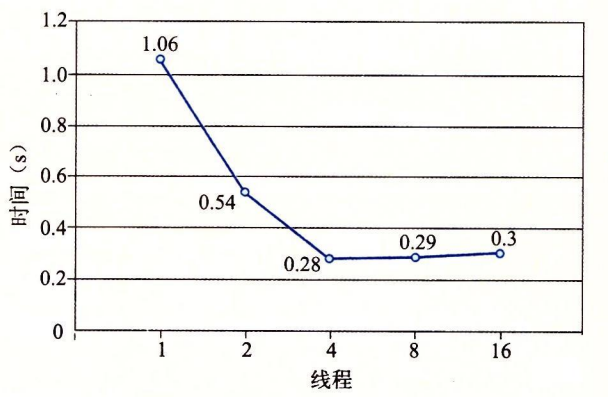

# 12.6 使用线程提高并行性

到目前为止，在对并发的研究中，我们都假设并发线程是在单处理器系统上执行的。然而，大多数现代机器具有多核处理器。并发程序通常在这样的机器上运行得更快，因为操作系统内核在多个核上并行地调度这些并发线程，而不是在单个核上顺序地调度。在像繁忙的 Web 服务器、数据库服务器和大型科学计算代码这样的应用中利用这样的并行性是至关重要的，而且在像 Web 浏览器、电子表格处理程序和文档处理程序这样的主流应用中，并行性也变得越来越有用。

图 12-30 给出了顺序、并发和并行程序之间的集合关系。所有程序的集合能够被划分成不相交的顺序程序集合和并发程序的集合。写顺序程序只有一条逻辑流。写并发程序有多条并发流。并行程序是一个运行在多个处理器上的并发程序。因此，并行程序的集合是并发程序集合的真子集。


并行程序的详细处理超出了本书讲述的范围，但是研究一个非常简单的示例程序能够帮助你理解并行编程的一些重要的方面。例如，考虑我们如何并行地对一列整数$$0，\cdots，n-1$$求和。当然，对于这个特殊的问题，有闭合形式表达式的解答（译者注：即有现成的公式来计算它，即和等于$$n(n-1)/2$$），但是尽管如此，它是一个简洁和易于理解的示例，能让我们对并行程序做一些有趣的说明。

将任务分配到不同线程的最直接方法是将序列划分成 t 个不相交的区域，然后给，个不同的线程每个分配一个区域。为了简单，假设 n 是 t 的倍数，这样每个区域有以 n/t 个元素。让我们来看看多个线程并行处理分配给它们的区域的不同方法。

最简单也最直接的选择是将线程的和放入一个共享全局变量中，用互斥锁保护这个变量。图 12-31 给出了我们会如何实现这种方法。在第 28 ~ 33 行，主线程创建对等线程，然后等待它们结束。注意，主线程传递给每个对等线程一个小整数，作为唯一的线程 ID。每个对等线程会用它的线程 ID 来决定它应该计算序列的哪一部分。这个向对等线程传递一个小的唯一的线程 ID 的思想是一项通用技术，许多并行应用中都用到了它。在对等线程终止后，全局变量 gsum 包含着最终的和。然后主线程用闭合形式解答来验证结果（第 36 ~ 37 行）。



```c
#include "csapp.h"
#define MAXTHREADS 32

void *sum_mutex(void *vargp); /* Thread routine */

/* Global shared variables */
long gsum = 0;          /* Global sum */
long nelems_per_thread; /* Number of elements to sum */
sem_t mutex;            /* Mutex to protect global sum */

int main(int argc, char **argv)
{
    long i, nelems, log_nelems, nthreads, myid[MAXTHREADS];
    pthread_t tid[MAXTHREADS];

    /* Get input arguments */
    if (argc != 3) {
        printf("Usage: %s <nthreads> <log_nelems>\n", argv[0]);
        exit(0);
    }
    nthreads = atoi(argv[1]);
    log_nelems = atoi(argv[2]);
    nelems = (1L << log_nelems);
    nelems_per_thread = nelems / nthreads;
    sem_init(&mutex, 0, 1);

    /* Create peer threads and wait for them to finish */
    for (i = 0; i < nthreads; i++) {
        myid[i] = i;
        Pthread_create(&tid[i], NULL, sum_mutex, &myid[i]);
    }
    for (i = 0; i < nthreads; i++)
        Pthread_join(tid[i], NULL);

    /* Check final answer */
    if (gsum != (nelems * (nelems - 1)) / 2)
        printf("Error: result=%ld\n", gsum);

    exit(0);
}
```



> 图 12-31 psum-mutex 的主程序，使用多个线程将一个序列元素的和放入一个用互斥锁保护的共享全局变量中

图 12-32 给出了每个对等线程执行的函数。在第 4 行中，线程从线程参数中提取出线程 ID，然后用这个 ID 来决定它要计算的序列区域（第 5 ~ 6 行）。在第 9 ~ 13 行中，线程在它的那部分序列上迭代操作，每次迭代都更新共享全局变量 gsum。注意，我们很小心地用 P 和 V 互斥操作来保护每次更新。



```c
/* Thread routine for psum-mutex.c */
void *sum_mutex(void *vargp)
{
    long myid = *((long *)vargp);          /* Extract the thread ID */
    long start = myid * nelems_per_thread; /* Start element index */
    long end = start + nelems_per_thread;  /* End element index */
    long i;
    
    for (i = start; i < end; i++) {
        P(&mutex);
        gsum += i;
        V(&mutex);
    }
    return NULL;
}
```



> 图 12-32 psum-mutex 的线程例程。每个对等线程将各自的和累加进一个用互斥锁保护的共享全局变量中

我们在一个四核系统上，对一个大小为 $$n=2^{31}$$ 的序列运行 psum-mutex，测量它的运行时间（以秒为单位），作为线程数的函数，得到的结果难懂又令人奇怪：

|  | 线程数 |  |  |  |  |
| :--- | :---: | :---: | :---: | :---: | :---: |
| 版本 | 1 | 2 | 4 | 8 | 16 |
| psum-mutex | 68 | 432 | 719 | 552 | 599 |

程序单线程顺序运行时非常慢，几乎比多线程并行运行时慢了一个数量级。不仅如此，使用的核数越多，性能越差。造成性能差的原因是相对于内存更新操作的开销，同步操作（P 和 V）代价太大。这突显了并行编程的一项重要教训：**同步开销巨大，要尽可能避免。如果无可避免，必须要用尽可能多的有用计算弥补这个开销。**

在我们的例子中，一种避免同步的方法是让每个对等线程在一个私有变量中计算它自己的部分和，这个私有变量不与其他任何线程共享，如图 12-33 所示。主线程（图中未显示）定义一个全局数组 psum，每个对等线程 i 把它的部分和累积在 **psum\[i\]** 中。因为小心地给了每个对等线程一个不同的内存位置来更新，所以不需要用互斥锁来保护这些更新。唯一需要同步的地方是主线程必须等待所有的子线程完成。在对等线程结束后，主线程把 psum 向量的元素加起来，得到最终的结果。



```c
/* Thread routine for psum-array.c */
void *sum_array(void *vargp)
{
    long myid = *((long *)vargp);          /* Extract the thread ID */
    long start = myid * nelems_per_thread; /* Start element index */
    long end = start + nelems_per_thread;  /* End element index */
    long i;

    for (i = start; i < end; i++) {
        psum[myid] += i;
    }
    return NULL;
}
```



> 图 12-33 psum-array 的线程例程。每个对等线程把它的部分和累积在一个私有数组元素中，不与其他任何对等线程共享该元素

在四核系统上运行 psum-array 时，我们看到它比 psum-mutex 运行得快好几个数量级：

|  | 线程数 |  |  |  |  |
| :--- | ---: | ---: | ---: | ---: | ---: |
| 版本 | 1 | 2 | 4 | 8 | 16 |
| psum-mutex | 68.00 | 432.00 | 719.00 | 552.00 | 599.00 |
| psum-array | 7.26 | 3.64 | 1.91 | 1.85 | 1.84 |

在第 5 章中，我们学习到了如何使用局部变量来消除不必要的内存引用。图 12-34 展示了如何应用这项原则，让每个对等线程把它的部分和累积在一个局部变量而不是全局变量中。当在四核机器上运行 psum-local 时，得到一组新的递减的运行时间：

|  | 线程数 |  |  |  |  |
| :--- | ---: | ---: | ---: | ---: | ---: |
| 版本 |  | 4 | 8 | 16 |  |
| psum-mutex | 68.00 | 432.00 | 719.00 | 552.00 | 599.00 |
| psum-array | 7.26 | 3.64 | 1.91 | 1.85 | 1.84 |
| psum-local | 1.06 | 0.54 | 0.28 | 0.29 | 0.30 |



```c
/* Thread routine for psum-local.c */
void *sum_local(void *vargp)
{
    long myid = *((long *)vargp);          /* Extract the thread ID */
    long start = myid * nelems_per_thread; /* Start element index */
    long end = start + nelems_per_thread;  /* End element index */
    long i, sum = 0;

    for (i = start; i < end; i++) {
        sum += i;
    }
    psum[myid] = sum;
    return NULL;
}
```



> 图 12-34 psum-local 的线程例程。每个对等线程把它的部分和累积在一个局部变量中

从这个练习可以学习到一个重要的经验，那就是写并行程序相当棘手。对代码看上去很小的改动可能会对性能有极大的影响。

## 刻画并行程序的性能

图 12-35 给出了图 12-34 中程序 psum-local 的运行时间，它是线程数的函数。在每个情况下，程序运行在一个有四个处理器核的系统上，对一个$$n=2^{31}$$个元素的序列求和。我们看到，随着线程数的增加，运行时间下降，直到增加到四个线程，此时，运行时间趋于平稳，甚至开始有点增加。



> 图 12-35 psum-local 的性能（图 12-34）。用四个处理器核对一个$$2^{32}$$个元素序列求和

在理想的情况中，我们会期望运行时间随着核数的增加线性下降。也就是说，我们会期望线程数每增加一倍，运行时间就下降一半。确实是这样，直到到达 t &gt; 4 的时候，此时四个核中的每一个都忙于运行至少一个线程。随着线程数量的增加，运行时间实际上增加了一点儿，这是由于在一个核上多个线程上下文切换的开销。由于这个原因，并行程序常常被写为每个核上只运行一个线程。

虽然绝对运行时间是衡量程序性能的终极标准，但是还是有一些有用的相对衡量标准能够说明并行程序有多好地利用了潜在的并行性。并行程序的**加速比**（speedup）通常定义为

$$
S_p=\frac{T_1}{T_p}
$$

这里 p 是处理器核的数量，$$T_k$$是在 k 个核上的运行时间。这个公式有时被称为**强扩展**（strong scaling）。当$$T_1$$是程序顺序执行版本的执行时间时，$$S_p$$称为**绝对加速比**（absolute speedup）。当$$T_1$$是程序并行版本在一个核上的执行时间时，$$S_p$$称为**相对加速比**（relative speedup）。绝对加速比比相对加速比能更真实地衡量并行的好处。即使是当并行程序在一个处理器上运行时，也常常会受到同步开销的影响，而这些开销会人为地增加相对加速比的数值，因为它们增加了分子的大小。另一方面，绝对加速比比相对加速比更难以测量，因为测量绝对加速比需要程序的两种不同的版本。对于复杂的并行代码，创建一个独立的顺序版本可能不太实际，或者因为代码太复杂，或者因为源代码不可得。

—种相关的测量量称为**效率**（efficiency），定义为

$$
E_p = \frac{S_p}{p}=\frac{T_1}{pT_p}
$$

通常表示为范围在$$(0,100]$$之间的百分比。效率是对由于并行化造成的开销的衡量。具有高效率的程序比效率低的程序在有用的工作上花费更多的时间，在同步和通信上花费更少的时间。

图 12-36 给出了我们并行求和示例程序的各个加速比和效率测量值。像这样超过 90% 的效率是非常好的，但是不要被欺骗了。能取得这么高的效率是因为我们的问题非常容易并行化。在实际中，很少会这样。数十年来，并行编程一直是一个很活跃的研究领域。随着商用多核机器的出现，这些机器的核数每几年就翻一番，并行编程会继续是一个深入、困难而活跃的研究领域。

|  |  |  |  |  |  |
| :--- | :---: | :---: | :---: | :---: | :---: |
| 线程（t） | 1 | 2 | 4 | 8 | 16 |
| 核（p） | 1 | 2 | 4 | 4 | 4 |
| 运行时间（$$T_p$$） | 1.06 | 0.54 | 0.28 | 0.29 | 0.30 |
| 加速比（$$S_p$$） | 1 | 1.9 | 3.8 | 3.7 | 3.5 |
| 效率（$$E_p$$） | 100% | 98% | 95% | 91% | 88% |

> 图 12-36   图 12-35 中执行时间的加速比和并行效率

加速比还有另外一面，称为**弱扩展**（weak scaling），在增加处理器数量的同时，增加问题的规模，这样随着处理器数量的增加，每个处理器执行的工作量保持不变。在这种描述中，加速比和效率被表达为单位时间完成的工作总量。例如，如果将处理器数量翻倍，同时每个小时也做了两倍的工作量，那么我们就有线性的加速比和 100% 的效率。

弱扩展常常是比强扩展更真实的衡量值，因为它更准确地反映了我们用更大的机器做更多的工作的愿望。对于科学计算程序来说尤其如此，科学计算问题的规模很容易增加，更大的问题规模直接就意味着更好地预测。不过，还是有一些应用的规模不那么容易增加，对于这样的应用，强扩展是更合适的。例如，实时信号处理应用所执行的工作量常常是由产生信号的物理传感器的属性决定的。改变工作总量需要用不同的物理传感器，这不太实际或者不太必要。对于这类应用，我们通常想要用并行来尽可能快地完成定量的工作。

### 练习题 12.11



对于下表中的并行程序，填写空白处。假设使用强扩展。

|  |  |  |  |
| :--- | :---: | :---: | :---: |
| 线程（t） | 1 | 2 | 4 |
| 核（p） | 1 | 2 | 4 |
| 运行时间（$$T_p$$） | 12 | 8 | 6 |
| 加速比（$$S_p$$） |  | 1.5 |  |
| 效率（$$E_p$$） | 100% |  | 50% |





这道题简单地检查你对加速比和并行效率的理解：

|  |  |  |  |
| :--- | :---: | :---: | :---: |
| 线程（t） | 1 | 2 | 4 |
| 核（p） | 1 | 2 | 4 |
| 运行时间（$$T_p$$） | 12 | 8 | 6 |
| 加速比（$$S_p$$） | **1** | 1.5 | **2** |
| 效率（$$E_p$$） | 100% | **75%** | 50% |



