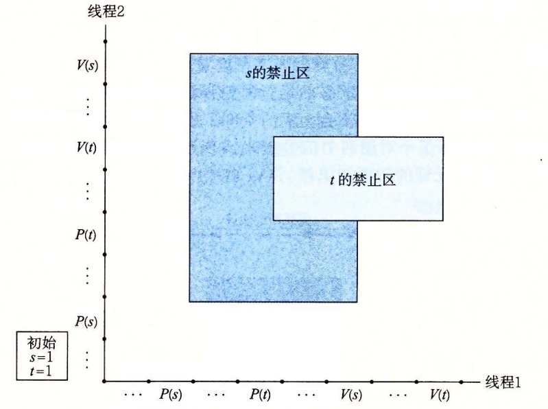
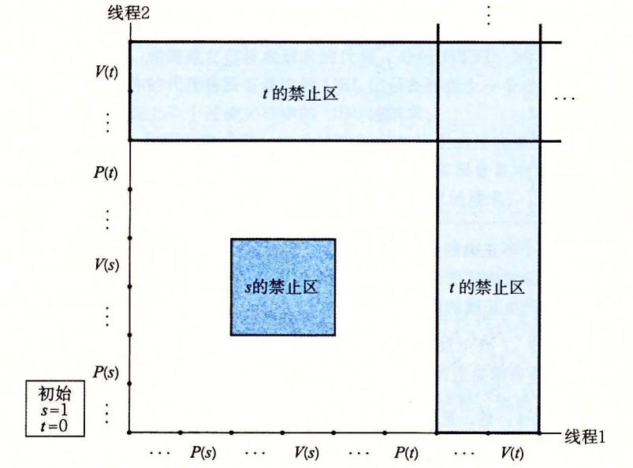

# 12.7 其他并发问题

你可能已经注意到了，一旦我们要求同步对共享数据的访问，那么事情就变得复杂得多了。迄今为止，我们已经看到了用于互斥和生产者—消费者同步的技术，但这仅仅是冰山一角。同步从根本上说是很难的问题，它引出了在普通的顺序程序中不会出现的问题。这一小节是关于你在写并发程序时需要注意的一些问题的（非常不完整的）综述。为了让事情具体化，我们将以线程为例描述讨论。不过要记住，这些典型问题是任何类型的并发流操作共享资源时都会出现的。

## 12.7.1 线程安全

当用线程编写程序时，必须小心地编写那些具有称为**线程安全性**（thread safety）属性的函数。一个函数被称为**线程安全的**（thread-safe），当且仅当被多个并发线程反复地调用时，它会一直产生正确的结果。如果一个函数不是线程安全的，我们就说它是**线程不安全的**（thread-unsafe）。

我们能够定义出四个（不相交的）线程不安全函数类：

**第 1 类：不保护共享变量的函数。**我们在图 12-16 的 thread 函数中就已经遇到了这样的问题，该函数对一个未受保护的全局计数器变量加 1。将这类线程不安全函数变成线程安全的，相对而言比较容易：利用像 P 和 V 操作这样的同步操作来保护共享的变量。这个方法的优点是在调用程序中不需要做任何修改。缺点是同步操作将减慢程序的执行时间。

**第 2 类：保持跨越多个调用的状态的函数。**一个伪随机数生成器是这类线程不安全函数的简单例子。请参考图 12-37 中的伪随机数生成器程序包。rand 函数是线程不安全的，因为当前调用的结果依赖于前次调用的中间结果。当调用 srand 为 rand 设置了一个种子后，我们从一个单线程中反复地调用 rand，能够预期得到一个可重复的随机数字序列。然而，如果多线程调用 rand 函数，这种假设就不再成立了。



```c
unsigned next_seed = 1;

/* rand - return pseudorandom integer in the range 0..32767 */
unsigned rand(void)
{
    next_seed = next_seed * 1103515245 + 12543;
    return (unsigned)(next_seed >> 16) % 32768;
}

/* srand - set the initial seed for rand() */
void srand(unsigned new_seed)
{
    next_seed = new_seed;
}
```



> 图 12-37 一个线程不安全的伪随机数生成器（基于【61】）

使得像 rand 这样的函数线程安全的唯一方式是重写它，使得它不再使用任何 static 数据，而是依靠调用者在参数中传递状态信息。这样做的缺点是，程序员现在还要被迫修

改调用程序中的代码。在一个大的程序中，可能有成百上千个不同的调用位置，做这样的修改将是非常麻烦的，而且容易出错。

**第 3 类：返回指向静态变量的指针的函数。**某些函数，例如 ctime 和 gethost-byname，将计算结果放在一个 static 变量中，然后返回一个指向这个变量的指针。如果我们从并发线程中调用这些函数，那么将可能发生灾难，因为正在被一个线程使用的结果会被另一个线程悄悄地覆盖了。

有两种方法来处理这类线程不安全函数。一种选择是重写函数，使得调用者传递存放结果的变量的地址。这就消除了所有共享数据，但是它要求程序员能够修改函数的源代码。

如果线程不安全函数是难以修改或不可能修改的（例如，代码非常复杂或是没有源代码可用），那么另外一种选择就是使用加锁—复制（lock-and-copy）技术。基本思想是将线程不安全函数与互斥锁联系起来。在每一个调用位置，对互斥锁加锁，调用线程不安全函数，将函数返回的结果复制到一个私有的内存位置，然后对互斥锁解锁。为了尽可能地减少对调用者的修改，你应该定义一个线程安全的包装函数，它执行加锁—复制，然后通过调用这个包装函数来取代所有对线程不安全函数的调用。例如，图 12-38 给出了 ctime 的一个线程安全的版本，利用的就是加锁—复制技术。



```c
char *ctime_ts(const time_t *timep, char *privatep)
{
    char *sharedp;
    
    P(&mutex);
    sharedp = ctime(timep);
    strcpy(privatep, sharedp); /* Copy string from shared to private */
    V(&mutex);
    return privatep;
}
```



> 图 12-38 C 标准库函数 ctime 的线程安全的包装函数。使用加锁—复制技术调用一个第 3 类线程不安全函数

**第 4 类：调用线程不安全函数的函数。**如果函数 f 调用线程不安全函数 g，那么 f 就是线程不安全的吗？不一定。如果 g 是第 2 类函数，即依赖于跨越多次调用的状态，那么 f 也是线程不安全的，而且除了重写 g 以外，没有什么办法。然而，如果 g 是第 1 类或者第 3 类函数，那么只要你用一个互斥锁保护调用位置和任何得到的共享数据，f 仍然可能是线程安全的。在图 12-38 中我们看到了一个这种情况很好的示例，其中我们使用加锁—复制编写了一个线程安全函数，它调用了一个线程不安全的函数。

## 12.7.2 可重入性

有一类重要的线程安全函数，叫做**可重入函数**（reentrant function），其特点在于它们具有这样一种属性：当它们被多个线程调用时，不会引用任何共享数据。尽管**线程安全**和**可重入**有时会（不正确地）被用做同义词，但是它们之间还是有清晰的技术差别，值得留意。图 12-39 展示了可重入函数、线程安全函数和线程不安全函数之间的集合关系。所有函数的集合被划分成不相交的线程安全和线程不安全函数集合。可重入函数集合是线程安全函数的一个真子集。


可重入函数通常要比不可重入的线程安全的函数高效一些，因为它们不需要同步操作。更进一步来说，将第 2 类线程不安全函数转化为线程安全函数的唯一方法就是重写它，使之变为可重入的。例如，图 12-40 展示了图 12-37 中 rand 函数的一个可重入的版本。关键思想是我们用一个调用者传递进来的指针取代了静态的 next 变量。



```c
/* rand_r - return a pseudorandom integer on 0..32767 */
int rand_r(unsigned int *nextp)
{
    *nextp = *nextp * 1103515245 + 12345;
    return (unsigned int)(*nextp / 65536) % 32768;
}
```



> 图 12-40 rand\_r：图 12-37 中的 rand 函数的可重入版本

检査某个函数的代码并先验地断定它是可重入的，这可能吗？不幸的是，不一定能这样。如果所有的函数参数都是传值传递的（即没有指针），并且所有的数据引用都是本地的自动栈变量（即没有引用静态或全局变量），那么函数就是**显式可重入的**（explicitly reentrant），也就是说，无论它是被如何调用的，都可以断言它是可重入的。

然而，如果把假设放宽松一点，允许显式可重入函数中一些参数是引用传递的（即允许它们传递指针），那么我们就得到了一个**隐式可重入的**（implicitly reentrant）函数，也就是说，如果调用线程小心地传递指向非共享数据的指针，那么它是可重入的。例如，图 12-40 中的 rand\_r 函数就是隐式可重入的。

我们总是使用术语**可重入的**（reentrant）既包括显式可重入函数也包括隐式可重入函数。然而，认识到可重入性有时既是调用者也是被调用者的属性，并不只是被调用者单独的属性是非常重要的。

### 练习题 12.12



图 12-38 中的 ctime\_ts 函数是线程安全的，但不是可重入的。请解释说明。





ctime\_ts 函数不是可重入函数，因为每次调用都共享相同的由 gethostbyname 函数返回的 static 变量。然而，它是线程安全的，因为对共享变量的访问是被 P 和 V 操作保护的，因此是互斥的。



## 12.7.3 在线程化的程序中使用已存在的库函数

大多数 Linux 函数，包括定义在标准 C 库中的函数（例如 malloc、free、realloc、printf 和 scanf）都是线程安全的，只有一小部分是例外。图 12-41 列出了常见的例外。（参考【110】可以得到一个完整的列表 Jstrtok 函数是一个已弃用的（不推荐使用）函数。asctime、ctime 和 localtime 函数是在不同时间和数据格式间相互来回转换时经常使用的函数。gethostbyname、gethostbyaddr 和 inet\_ntoa 函数是已弃用的网络编程函数，已经分别被可重入的 getaddrinfo、getnameinfo 和 inet\_ntop 函数取代（见第 11 章）。除了 rand 和 strtok 以外，所有这些线程不安全函数都是第 3 类的，它们返回一个指向静态变量的指针。如果我们需要在一个线程化的程序中调用这些函数中的某一个，对调用者来说最不惹麻烦的方法是加锁—复制。

| 线程不安全函数 | 线程不安全类 | Linux 线程安全版本 |
| :--- | :---: | :--- |
| rand | 2 | rand\_r |
| strtok | 2 | strtok\_r |
| asctime | 3 | asctime\_r |
| ctime | 3 | ctime\_r |
| gethostbyaddr | 3 | gethostbyaddr\_r |
| gethostbyname | 3 | gethostbyname\_r |
| inet\_ntoa | 3 | （无） |
| localtime | 3 | localtime\_r |

> 图 12-41 常见的线程不安全的库函数

然而，加锁—复制方法有许多缺点。

* 首先，额外的同步降低了程序的速度。
* 第二，像 gethostbyname 这样的函数返回指向复杂结构的结构的指针，要复制整个结构层次，需要**深层复制**（deepcopy）结构。
* 第三，加锁—复制方法对像 rand 这样依赖跨越调用的静态状态的第 2 类函数并不有效。

因此，Linux 系统提供大多数线程不安全函数的可重入版本。可重入版本的名字总是以 “\_r” 后缀结尾。例如，asctime 的可重入版本就叫做 asctime\_r。我们建议尽可能地使用这些函数。

## 12.7.4 竞争

当一个程序的正确性依赖于一个线程要在另一个线程到达 y 点之前到达它的控制流中的 x 点时，就会发生**竞争**（race）。通常发生竞争是因为程序员假定线程将按照某种特殊的轨迹线穿过执行状态空间，而忘记了另一条准则规定：多线程的程序必须对任何可行的轨迹线都正确工作。

例子是理解竞争本质的最简单的方法。让我们来看看图 12-42 中的简单程序。主线程创建了四个对等线程，并传递一个指向一个唯一的整数 ID 的指针到每个线程。每个对等线程复制它的参数中传递的 ID 到一个局部变量中（第 22 行），然后输出一个包含这个 ID 的信息。它看上去足够简单，但是当我们在系统上运行这个程序时，我们得到以下不正确的结果：



```c
/* WARNING: This code is buggy! */
#include "csapp.h"
#define N 4

void *thread(void *vargp);

int main()
{
    pthread_t tid[N];
    int i;

    for (i = 0; i < N; i++)
        Pthread_create(&tid[i], NULL, thread, &i);
    for (i = 0; i < N; i++)
        Pthread_join(tid[i], NULL);
    exit(0);
}

/* Thread routine */
void *thread(void *vargp)
{
    int myid = *((int *)vargp);
    printf("Hello from thread %d\n", myid);
    return NULL;
}
```



> 图 12-42 一个具有竞争的程序

问题是由每个对等线程和主线程之间的竞争引起的。你能发现这个竞争吗？下面是发生的情况。当主线程在第 13 行创建了一个对等线程，它传递了一个指向本地栈变量 i 的指针。在此时，竞争出现在下一次在第 12 行对 i 加 1 和第 22 行参数的间接引用和赋值之间。如果对等线程在主线程执行第 12 行对 i 加 1 之前就执行了第 22 行，那么 myid 变量就得到正确的 ID。否则，它包含的就会是其他线程的 ID。令人惊慌的是，我们是否得到正确的答案依赖于内核是如何调度线程的执行的。在我们的系统中它失败了，但是在其他系统中，它可能就能正确工作，让程序员 “幸福地”察觉不到程序的严重错误。

为了消除竞争，我们可以动态地为每个整数 ID 分配一个独立的块，并且传递给线程例程一个指向这个块的指针，如图 12-43 所示（第 12 ~ 14 行）。请注意线程例程必须释放这些块以避免内存泄漏。



```c
#include "csapp.h"
#define N 4

void *thread(void *vargp);

int main()
{
    pthread_t tid[N];
    int i, *ptr;

    for (i = 0; i < N; i++) {
        ptr = Malloc(sizeof(int));
        *ptr = i;
        Pthread_create(&tid[i], NULL, thread, ptr);
    }
    for (i = 0; i < N; i++)
        Pthread_join(tid[i], NULL);
    exit(0);
}

/* Thread routine */
void *thread(void *vargp)
{
    int myid = *((int *)vargp);
    Free(vargp);
    printf("Hello from thread %d\n", myid);
    return NULL;
}
```



> 图 12-43   图 12-42 中程序的一个没有竞争的正确版本

当我们在系统上运行这个程序时，现在得到了正确的结果：

```c
linux> ./race
Hello from thread 1
Hello from thread 3
Hello from thread 2
Hello from thread 3
```

### 练习题 12.13



在图 12-43 中，我们可能想要在主线程中的第 14 行后立即释放已分配的内存块，而不是在对等线程中释放它。但是这会是个坏注意。为什么？





如果在第 14 行调用了 pthread\_create 之后，我们立即释放块，那么将引入一个新的竞争，这次竞争发生在主线程对 free 的调用和线程例程中第 24 行的赋值语句之间。



### 练习题 12.14



A. 在图 12-43 中，我们通过为每个整数 ID 分配一个独立的块来消除竞争。给出一个不调用 malloc 或者 free 函数的不同的方法。

B. 这种方法的利弊是什么？





A. 另一种方法是直接传递整数 ****i，而不是传递一个指向 i 的指针：

```c
for (i = 0; i < N; i++)
    Pthread_create(&tid[i], NULL, thread, (void *)i);
```

在线程例程中，我们将参数强制转换成一个 int 类型，并将它赋值给 myid：

```c
int myid = (int) vargp;
```

B. 优点是它通过消除对 malloc 和 free 的调用降低了开销。一个明显的缺点是，它假设指针至少和 int 一样大。即便这种假设对于所有的现代系统来说都为真，但是它对于那些过去遗留下来的或今后的系统来说可能就不为真了。



## 12.7.5 死锁

信号量引入了一种潜在的令人厌恶的运行时错误，叫做**死锁**（deadlock），它指的是一组线程被阻塞了，等待一个永远也不会为真的条件。进度图对于理解死锁是一个无价的工具。例如，图 12-44 展示了一对用两个信号量来实现互斥的线程的进程图。


从这幅图中，我们能够得到一些关于死锁的重要知识：

* 程序员使用 P 和 V 操作顺序不当，以至于两个信号量的禁止区域重叠。如果某个执行轨迹线碰巧到达了**死锁状态 d**，那么就不可能有进一步的进展了，因为重叠的禁止区域阻塞了每个合法方向上的进展。换句话说，程序死锁是因为每个线程都在等待其他线程执行一个根不可能发生的 V 操作。
* 重叠的禁止区域引起了一组称为**死锁区域**（deadlock region）的状态。如果一个轨迹线碰巧到达了一个死锁区域中的状态，那么死锁就是不可避免的了。轨迹线可以进入死锁区域，但是它们不可能离开。
* 死锁是一个相当困难的问题，因为它不总是可预测的。一些幸运的执行轨迹线将绕开死锁区域，而其他的将会陷入这个区域。图 12-44 展示了每种情况的一个示例。对于程序员来说，这其中隐含的着实令人惊慌。你可以运行一个程序 1000 次不出任何问题，但是下一次它就死锁了。或者程序在一台机器上可能运行得很好，但是在另外的机器上就会死锁。最糟糕的是，错误常常是不可重复的，因为不同的执行有不同的轨迹线。

程序死锁有很多原因，要避免死锁一般而言是很困难的。然而，当使用二元信号量来实现互斥时，如图 12-44 所示，你可以应用下面的简单而有效的规则来避免死锁：

**互斥锁加锁顺序规则：给定所有互斥操作的一个全序，如果每个线程都是以一种顺序获得互斥锁并以相反的顺序释放，那么这个程序就是无死锁的。**

例如，我们可以通过这样的方法来解决图 12-44 中的死锁问题：在每个线程中先对 s 加锁，然后再对 t 加锁。图 12-45 展示了得到的进度图。



### 练习题 12.15



思考下面的程序，它试图使用一对信号量来实现互斥。

```c
初始时： s = 1, t = 0.

线程 1    |   线程 2
---------|-----------
P(s);    |   P(s);
V(s);    |   V(s);
P(t);    |   P(t);
V(t);    |   V(t);
```

A. 画出这个程序的进度图。

B. 它总是会死锁吗？

C. 如果是，那么对初始信号量的值做哪些简单的改变就能消除这种潜在的死锁呢？

D. 画出得到的无死锁程序的进度图。





A. 原始的程序的进度图如图 12-48 所示。



B. 因为任何可行的轨迹最终都陷入死锁状态中，所以这个程序总是会死锁。

C. 为了消除潜在的死锁，将二元信号量 t 初始化为 1 而不是 0。

D. 改成后的程序的进度图如图 12-49 所示。





